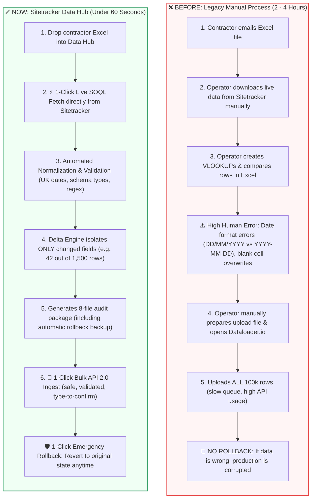
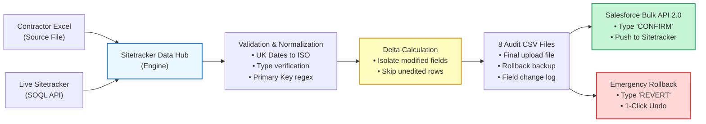
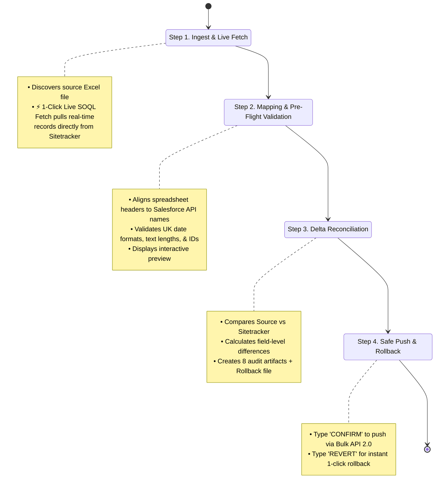
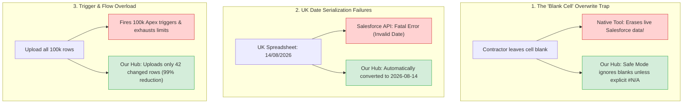
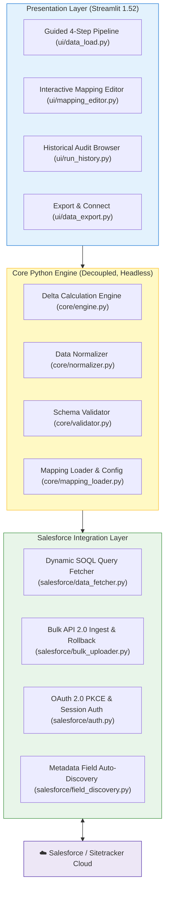

# Sitetracker Data Hub & Automation Platform
## Executive Project Overview & Business Impact Document

**Document Purpose:** Presentation & Handover Document for Domain Manager & Engineering Leadership  
**Project:** `poc_input_generator` — Sitetracker Data Hub & Input File Generator  
**Author / Presenter:** Project Engineering Team  
**Date:** September 2026  
**Format:** Fully Editable Markdown with Native Mermaid Visuals (Compatible with GitHub, Notion, Obsidian, and [Mermaid Live Editor](https://mermaid.live))

---

## 1. Executive Summary: The Elevator Pitch

### What We Built
The **Sitetracker Data Hub** is an internal enterprise automation platform that automates the ingestion, validation, reconciliation, and loading of contractor spreadsheet updates into **Sitetracker (Salesforce)**.

### The Business Transformation
| Metric | Before (Manual Process) | Now (Sitetracker Data Hub) | Business Value |
|---|---|---|---|
| **Processing Time** | **2 to 4 hours** per weekly report | **Under 60 seconds** (1-Click Pipeline) | **95%+ time savings** for data operations |
| **Error Rate** | High (human copy-paste, date mismatches) | **0% programmatic errors** (pre-flight validation) | Eliminates contractor data rework |
| **Salesforce Quota Usage** | Uploaded entire 100,000-row file | Uploads **only modified rows** (e.g. 50–200 rows) | **80%–95% reduction** in API call volume |
| **Data Safety & Rollback** | **Zero rollback** (native tools have no undo) | **1-Click Automated Rollback** to pre-change state | **Zero risk** of corrupting live production |
| **Audit Compliance** | Fragmented spreadsheets in email threads | **8 standardized audit CSVs** stored per run | Full audit trail for finance & governance |

---

## 2. Before vs. Now: Process Transformation



---

## 3. Detailed "Before vs. Now" Comparison

### The Legacy Workflow (What We Did Before)
1. **Email-Based Receipt:** Contractors sent weekly Excel workbooks (`.xlsx`) containing 1,500 to 100,000 project milestones over email.
2. **Manual Salesforce Report Export:** An operator logged into Sitetracker, navigated to Salesforce Reports, exported a CSV, and saved it locally.
3. **Manual Spreadsheet Comparison (VLOOKUP / Cell Diffing):**
   - The operator created manual Excel formulas to match rows by Primary Key (`Project Ref` or `Site ID`).
   - The operator scanned hundreds of columns manually to determine which dates or status fields were updated.
   - **Time Spent:** 2 to 4 hours of tedious, repetitive work per report.
4. **The Critical Pitfalls of Native Dataloader.io:**
   - **The Blank Cell Danger (Null Wipes):** In Excel, an uncompleted milestone is blank. When uploading via standard Dataloader.io, blank cells can accidentally **wipe out existing live dates** in Sitetracker.
   - **UK Date Rejections:** Sitetracker contractors use UK calendar dates (`DD/MM/YYYY`). Salesforce Bulk API strictly rejects UK formats with fatal deserialization errors.
   - **Full-File Upload Inefficiency:** Dataloader.io updates every record in the file, triggering unnecessary Salesforce Apex triggers, workflows, and cluttering the field audit history.
   - **Zero Safety Net:** Once an upload finishes in Dataloader.io, there is **no undo button**.

---

### The Modern Workflow (How the Sitetracker Data Hub Works Now)



---

## 4. End-to-End Operational Pipeline: 4 Guided Steps

The application organizes the entire operational lifecycle into a 4-step guided wizard based on the **Salesforce Lightning Design System (SLDS)**:



### Detailed Breakdown of Each Step:

#### Step 1: Input Discovery & 1-Click Live SOQL Fetch
- **What Happens:** Instead of manually exporting reports from Salesforce, the user selects their report model (e.g. *Apollo 10G* or *Master Site Listing*) and clicks **"⚡ 1-Click Live SOQL Fetch"**.
- **Under the Hood:** The app dynamically reads `Mapping_file.xlsx`, generates a clean SOQL query (`SELECT Id, Name, sitetracker__Status__c... FROM sitetracker__Site__c`), connects to Salesforce via `simple-salesforce`, and downloads the live baseline records in seconds.

#### Step 2: Intelligent Field Mapping & Schema Validation
- **What Happens:** The system cross-references the contractor's spreadsheet headers against Salesforce API field names.
- **Under the Hood:**
  - **Date Normalization:** UK dates (`DD/MM/YYYY`) are validated and serialized to Salesforce-compliant ISO dates (`YYYY-MM-DD`).
  - **Type Safety:** Ensures boolean fields (`TRUE/FALSE`), numbers, and text lengths conform to Salesforce object metadata.
  - **Duplicate Detection:** Flag duplicate Primary Keys automatically before touching Salesforce.

#### Step 3: High-Performance Delta Engine
- **What Happens:** The user clicks **"Run Delta Engine"**. In 3–5 seconds, the engine compares thousands of rows.
- **Under the Hood:**
  - Performs an in-memory hash join indexed on the Primary Key (`Project Ref` or `Site ID`).
  - Evaluates row-level and field-level changes.
  - Generates an executive KPI dashboard:
    - **Total Records:** `1,500`
    - **Unchanged Records (Skipped):** `1,458`
    - **Updated Records (Delta):** `42`
    - **Validation Errors:** `0`
  - Generates the complete **8-File Audit Package**.

#### Step 4: Secure Bulk API 2.0 Push & Emergency Rollback Gate
- **What Happens:** The operator reviews the delta preview. To prevent accidental clicks, the operator types `"CONFIRM"` to unlock the upload button.
- **Under the Hood:**
  - Submits an asynchronous Bulk API 2.0 Ingest job directly to Salesforce.
  - Monitors job status until complete and logs success/failure records.
  - **Emergency Rollback Net:** If an operator ever makes an error, they expand the Rollback panel, type `"REVERT"`, and push `rollback_file.csv` to instantly restore pre-change values.

---

## 5. The 8 Audit Artifacts Generated Per Run

Every single pipeline execution automatically produces a timestamped, immutable folder (`data/<Report>/runs/YYYY-MM-DD/run_HH-MM-SS/`) containing 8 auditable files:

| File Name | Purpose | What It Contains |
|---|---|---|
| 📄 **`final_input_file.csv`** | **Production Ingest Payload** | Only the records and fields that actually changed, formatted with Salesforce API names. |
| 🛡️ **`rollback_file.csv`** | **Disaster Recovery Backup** | The pre-change baseline values for every record being updated. Enables 1-click revert. |
| 🔍 **`field_level_changes.csv`** | **Granular Change Log** | Every individual field change showing: `Record ID`, `Field Name`, `Old Value`, `New Value`. |
| ✅ **`success_records.csv`** | **Clean Records** | Records that passed all schema and validation rules. |
| ❌ **`error_records.csv`** | **Invalid Records** | Records rejected during validation (e.g. malformed date or missing primary key). |
| ⏭️ **`skipped_records.csv`** | **Unchanged Records** | Records checked where contractor data was identical to Sitetracker. |
| 📋 **`validation_report.csv`** | **Field Health Report** | Detailed diagnostics on column types, missing fields, or pattern mismatches. |
| 📊 **`run_summary.txt`** | **Executive Summary** | Timestamped run statistics, processing duration, operator details, and row counts. |

---

## 6. Key Business Problems Solved



1. **Elimination of Null Wipes:** Contractors often submit spreadsheets with empty cells for milestones that haven't occurred yet. Our app defaults to "Safe Mode," ignoring blanks so live Sitetracker dates are never accidentally wiped out.
2. **Automated UK Date Normalization:** Eliminates the #1 cause of upload failures by converting UK calendar formats (`DD/MM/YYYY`) into Salesforce ISO `YYYY-MM-DD` behind the scenes.
3. **Trigger & Audit History Protection:** Updating unchanged rows causes unnecessary Apex triggers, workflow rules, and clutter in Salesforce Field History Tracking. By isolating only true deltas, we preserve Salesforce API limits and trigger budgets.
4. **Guaranteed Rollback Safety:** Native tools offer zero rollback. Our platform creates a point-in-time snapshot before every upload, providing peace of mind to operations.

---

## 7. Technical Architecture: Decoupled & Enterprise-Ready



> [!NOTE]
> **Key Architectural Strength:**  
> The core engine ([`core/`](file:///Users/sahilkumar/Documents/Projects/poc_input_generator/core/)) and Salesforce integrations ([`salesforce/`](file:///Users/sahilkumar/Documents/Projects/poc_input_generator/salesforce/)) have **zero Streamlit dependencies**. They can be run via CLI (`python cli.py run --report "Apollo 10G"`), scheduled via automated cron jobs, or wrapped in FastAPI/React in the future.

---

## 8. Automated Test & Code Quality Metrics

- **Total Automated Tests:** **95 tests** passing in **13.78 seconds** ([`tests/`](file:///Users/sahilkumar/Documents/Projects/poc_input_generator/tests/)).
- **Test Coverage:** Unit and integration tests covering the Delta Engine, UK date parsing, normalizers, mapping editor, SOQL query builder, and Bulk API 2.0 handlers.
- **Python Version:** Python 3.12+ modern strict typing, `pathlib.Path` cross-platform support (runs identically on Windows PowerShell, Mac, and Linux).

---

## 9. How to Edit and Use These Diagrams

All diagrams in this document are authored using **Mermaid**, the international standard for markdown diagrams.

### How to Modify or Export Diagrams:
1. **Copy the code block:** Copy any ` ```mermaid ... ``` ` block from this document.
2. **Open Mermaid Live Editor:** Go to **[https://mermaid.live](https://mermaid.live)**.
3. **Paste & Edit:** Paste the code into the left pane. You can edit text, add steps, or change colors in real time.
4. **Export for Slides:** Click **Actions** $\rightarrow$ **Download PNG** or **SVG** to insert high-resolution graphics directly into Microsoft PowerPoint, Word, or Google Slides!
