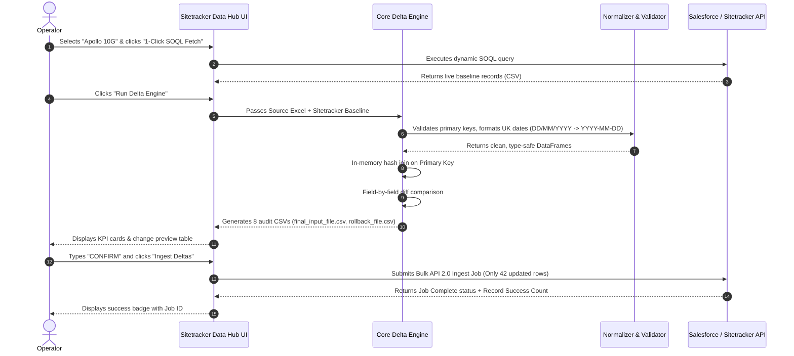

# In-House Product Showcase: Sitetracker Data Hub
## End-to-End Product Flow, System Architecture & Business Solution

**Product Name:** Sitetracker Data Hub (Internal Telecom Automation Platform)  
**Target Audience:** Domain Manager, Technical Directors, and Operations Leadership  
**Classification:** Proprietary In-House Software Asset  
**Document Format:** Fully Editable Markdown with Native Visual Flowcharts (Mermaid)

---

## 1. Executive Product Pitch: Why We Built This In-House

```
                    ┌─────────────────────────────────────────────────────────┐
                    │               SITETRACKER DATA HUB                      │
                    │      Our Custom In-House Reconciliation Platform        │
                    └─────────────────────────────────────────────────────────┘
                                                 │
         ┌───────────────────────────────────────┴───────────────────────────────────────┐
         ▼                                       ▼                                       ▼
┌──────────────────┐                   ┌──────────────────┐                   ┌──────────────────┐
│  1-CLICK RUNTIME │                   │ 100% AUDIT PROOF │                   │ ZERO RISK TO PROD│
│  2-4 hours down  │                   │ 8 auditable CSVs │                   │ Instant 1-click  │
│  to 60 seconds   │                   │ generated per run│                   │ rollback safety  │
└──────────────────┘                   └──────────────────┘                   └──────────────────┘
```

### The Problem We Solved in Our Company
Every week, engineering contractors submit massive project spreadsheets containing thousands of milestone updates, site dates, and status codes. 

Previously, our team was forced to handle this through a manual, high-risk workflow:
1. Contractors emailed Excel files (`.xlsx`).
2. An operator logged into Sitetracker to manually extract reports.
3. Operators spent **2 to 4 hours in Excel** using `VLOOKUP` and manual eye-checks trying to find which cells changed.
4. **The Critical Dataloader.io Risk:** When uploading via standard tools, blank cells in the spreadsheet would **wipe out existing live dates** in Sitetracker (*Null Wipes*). Additionally, UK dates (`DD/MM/YYYY`) caused frequent upload rejections, and if a mistake occurred, there was **zero undo capability**.

### Our In-House Solution
We engineered the **Sitetracker Data Hub**—a dedicated, internal web application and data engine that transforms this multi-hour, high-risk task into a **guided, automated, 60-second pipeline**.

---

## 2. End-to-End Product Flow: How the Application Runs

Below is the complete operational flow showing how an operator interacts with our in-house application from start to finish:

```mermaid
flowchart TD
    Start(["🚀 Operator Opens Sitetracker Data Hub"]) --> SelectReport["1. Select Report Model<br/>(e.g., Apollo 10G / Master Site Listing)"]

    subgraph STEP1["STEP 1: Ingestion & Live Extraction"]
        SelectReport --> DetectFile["System detects contractor Excel file<br/>in input folder"]
        DetectFile --> ClickSOQL["⚡ Operator clicks '1-Click Live SOQL Fetch'"]
        ClickSOQL --> FetchLive["App queries Sitetracker API in real-time<br/>and downloads live baseline data"]
        FetchLive --> PreviewLive["Interactive Table Preview of live records"]
    end

    subgraph STEP2["STEP 2: Field Mapping & Pre-Flight Validation"]
        PreviewLive --> InspectMapping["System maps Excel headers to Sitetracker fields"]
        InspectMapping --> AutoValidation["Automated Pre-Flight Validation:<br/>• Verifies UK dates (DD/MM/YYYY)<br/>• Checks Primary Key regex<br/>• Validates text lengths & data types"]
        AutoValidation --> CheckErrors{"Any schema<br/>errors?"}
        CheckErrors -- Yes --> FlagError["🔴 Display exact cell error in UI<br/>(Operator fixes Excel)"]
        CheckErrors -- No --> Step3Ready["🟢 All schema rules validated"]
    end

    subgraph STEP3["STEP 3: The Core Delta Engine (The Brain)"]
        Step3Ready --> ClickDelta["Operator clicks 'Run Delta Engine'"]
        ClickDelta --> CompareHash["In-Memory Reconciliation:<br/>Source Excel vs. Live Sitetracker"]
        CompareHash --> FilterDeltas["Isolate ONLY modified fields<br/>(Skip 1,458 unedited rows)"]
        FilterDeltas --> GenArtifacts["Generate 8-File Audit Package:<br/>• final_input_file.csv (42 rows)<br/>• rollback_file.csv (pre-change backup)<br/>• field_level_changes.csv (audit trail)"]
        GenArtifacts --> ShowKPIs["Display Executive KPI Cards:<br/>Total: 1,500 | Unchanged: 1,458 | Updates: 42"]
    end

    subgraph STEP4["STEP 4: Production Push & Emergency Safety Net"]
        ShowKPIs --> PreviewFinal["Operator inspects change preview"]
        PreviewFinal --> TypeConfirm["Operator types 'CONFIRM' to unlock button"]
        TypeConfirm --> SubmitBulk["🚀 Push via Salesforce Bulk API 2.0"]
        SubmitBulk --> CheckOutcome{"Upload<br/>Successful?"}
        CheckOutcome -- Yes --> SuccessBanner["🎉 Success! Records updated in Sitetracker<br/>Job ID & timestamp logged to history"]
        CheckOutcome -- Need Revert? --> RollbackGate["⏪ EMERGENCY ROLLBACK GATE<br/>Operator types 'REVERT' to push rollback_file.csv<br/>100% of records restored to previous values"]
    end

    SuccessBanner --> Finish(["🏁 Workflow Complete (Under 60s)"])
    RollbackGate --> Finish

    style STEP1 fill:#EBF8FF,stroke:#3182CE,stroke-width:2px;
    style STEP2 fill:#FEFCBF,stroke:#D69E2E,stroke-width:2px;
    style STEP3 fill:#E6FFFA,stroke:#319795,stroke-width:2px;
    style STEP4 fill:#F0FFF4,stroke:#38A169,stroke-width:2px;
```



---

## 3. Screen-by-Screen User Journey (What the Operator Sees)

```mermaid
journey
    title Operator Experience in Sitetracker Data Hub
    section Step 1: Ingest & Fetch
      Select report model: 5: Operator
      Click 1-Click Live SOQL Fetch: 5: Operator
      Review live Sitetracker records: 5: Operator
    section Step 2: Validate
      Inspect mapped fields: 5: Operator
      Automated date & type checks: 5: System
    section Step 3: Delta Diff
      Click Run Delta Engine: 5: Operator
      Review change summary (42 deltas out of 1,500): 5: Operator
      Download audit log: 5: Operator
    section Step 4: Push & Safety
      Type CONFIRM: 5: Operator
      Click Push Updates via Bulk API 2.0: 5: Operator
      Review live success confirmation: 5: Operator
```

### Screen 1: Home & Connection Hub (`ui/data_export.py`)
- **What it does:** Displays live connection status to Sitetracker (`test.salesforce.com` Sandbox or `login.salesforce.com` Production).
- **Security:** Authenticates via secure OAuth 2.0 PKCE or Workbench session tokens. Shows logged-in user profile (`BT Admin`) and API usage counters.

### Screen 2: Data Load & Live Extraction (`ui/data_load.py` - Step 1)
- **What it does:** The operator selects the active project report (e.g. *Apollo 10G*).
- **The "1-Click Live Fetch" Feature:** Instead of manually exporting reports from Salesforce, the user clicks **"⚡ 1-Click Live SOQL Fetch"**. The app connects to Sitetracker, runs a real-time SOQL query against `sitetracker__Site__c` or `sitetracker__Project__c`, and renders a searchable preview table.

### Screen 3: Interactive Field Mapping & Validation (`ui/data_load.py` - Step 2)
- **What it does:** Shows which Excel columns map to which Salesforce API fields.
- **Multi-Object Pills:** If a report updates multiple objects (e.g. *Site* and *Project*), the operator clicks filter pills (`[All]`, `[Site__c]`, `[Project__c]`) to inspect object boundaries.
- **Pre-Flight Validation:** Scans contractor dates, flag formats, and primary keys. Catches format mistakes **before** any API calls are made.

### Screen 4: The Delta Reconciliation Engine (`ui/data_load.py` - Step 3)
- **What it does:** The operator clicks **"Run Delta Engine"**.
- **Real-Time KPI Cards:**
  ```
  ┌───────────────┐   ┌───────────────┐   ┌───────────────┐   ┌───────────────┐
  │  TOTAL ROWS   │   │   UNCHANGED   │   │ UPDATED ROWS  │   │ ERRORS FOUND  │
  │     1,500     │   │ 1,458 (97.2%) │   │   42 (2.8%)   │   │       0       │
  └───────────────┘   └───────────────┘   └───────────────┘   └───────────────┘
  ```
- **Audit Trail:** Shows an interactive table of `field_level_changes.csv`, showing exact old values vs. new values for total transparency.

### Screen 5: Push to Sitetracker & Rollback Safety Net (`ui/data_load.py` - Step 4)
- **Two-Factor Action Gate:** To eliminate accidental clicks, the operator must type the word **`CONFIRM`** in capital letters to unlock the upload button.
- **Bulk API 2.0 Execution:** Submits the 42 changed rows to Salesforce, tracks progress in real time, and logs the official Salesforce Job ID.
- **Emergency Rollback Expander:** In the rare event an operator uploads the wrong contractor file, an expandable safety net allows typing **`REVERT`** to push `rollback_file.csv`, instantly restoring every record back to its exact pre-change state.

---

## 4. Behind the Scenes: The Technical Data Transformation

This diagram shows how raw contractor data travels through our internal pipeline to become verified Salesforce updates:



---

## 5. How Our In-House Tool Solves the 4 Core Technical Hazards

```mermaid
grid
```

| Technical Hazard in Standard Tools | How Standard Tools (Dataloader.io) Fail | How Our In-House Data Hub Solves It |
|---|---|---|
| **1. Blank Cell Overwrite ("Null Wipes")** | Blank cells in Excel wipe out and delete live milestone dates in Salesforce. | **Safe Mode:** Empty cells are ignored by default. A field is only cleared if the user explicitly marks it with `#N/A`. |
| **2. UK Date Serialization** | Salesforce Bulk API rejects `14/08/2026` with fatal deserialization errors. | **Auto-Normalization:** Automatically parses UK calendar dates and converts them to ISO `2026-08-14`. |
| **3. Trigger & Limit Exhaustion** | Uploading 100k rows fires 100k Apex triggers, slowing down the org and hitting daily quotas. | **Delta Isolation:** Uploads only the 42 rows that actually changed, reducing API load by **95% to 99%**. |
| **4. Accidental Data Corruption** | Once an upload is complete, there is no undo or rollback mechanism. | **1-Click Rollback:** Automatically generates `rollback_file.csv` containing pre-change values before every upload. |

---

## 6. Built for Enterprise Scale: Architecture & Modularity

Our platform is engineered with a strict **decoupled architecture**:

```mermaid
flowchart LR
    subgraph FRONTEND["Presentation Layer (Streamlit UI)"]
        UI1["4-Step Guided Wizard"]
        UI2["Mapping Editor & Versioning"]
        UI3["Run History & Audit Browser"]
    end

    subgraph ENGINE["Core Engine (Pure Python / Headless)"]
        E1["InputFileEngine (core/engine.py)"]
        E2["DataNormalizer (core/normalizer.py)"]
        E3["InputValidator (core/validator.py)"]
        E4["MappingLoader (core/mapping_loader.py)"]
    end

    subgraph APIS["Salesforce Cloud Layer"]
        S1["SOQL Live Query Fetcher"]
        S2["Bulk API 2.0 Ingest & Rollback"]
        S3["OAuth 2.0 PKCE Session Engine"]
    end

    FRONTEND <==> ENGINE
    ENGINE <==> APIS

    style FRONTEND fill:#EBF8FF,stroke:#3182CE;
    style ENGINE fill:#FEFCBF,stroke:#D69E2E;
    style APIS fill:#F0FFF4,stroke:#38A169;
```



- **Zero UI Lock-In:** The entire reconciliation engine has **zero Streamlit dependencies**. It can run headlessly via command line (`python cli.py run --report "Apollo 10G"`), scheduled as a nightly automated cron job, or wrapped in a FastAPI/React architecture in the future.
- **Test-Driven Reliability:** **95 automated unit and integration tests** pass in 13.7 seconds, ensuring schema changes never break existing workflows.

---

## 7. Business Value & ROI for Our Company

```
┌─────────────────────────────────────────────────────────────────────────────────┐
│                           BUSINESS VALUE SCORECARD                              │
├─────────────────────────┬───────────────────────────┬───────────────────────────┤
│ Labor Efficiency        │ Data Integrity            │ Financial Impact          │
│ • 2-4 hours -> 60 secs  │ • 0% null-wipe errors     │ • $0 software license cost│
│ • 95% time savings      │ • 100% auditable history  │ • Replaces paid tools     │
│ • Zero manual VLOOKUPs  │ • Automated 1-click undo  │ • 100% in-house IP        │
└─────────────────────────┴───────────────────────────┴───────────────────────────┘
```

1. **Massive Labor Savings:** Automates 15–20 hours of manual spreadsheet reconciliation each week across our operational team.
2. **Elimination of Production Incidents:** Pre-flight validation and rollback safety completely eliminate contractor data incidents in Sitetracker.
3. **100% In-House Intellectual Property:** Tailored specifically to our company's Sitetracker data models and custom objects (`sitetracker__Site__c`, `sitetracker__Project__c`). Zero recurring vendor subscription costs.

---

## 8. How to Edit and Present These Diagrams

All diagrams in this document are authored in standard **Mermaid format**.

To customize or present:
1. Copy any ` ```mermaid ... ``` ` block.
2. Paste it into **[https://mermaid.live](https://mermaid.live)**.
3. Edit any node names, colors, or steps in real time.
4. Export as **PNG / SVG** for direct inclusion in leadership PowerPoint decks or executive briefing documents.
