# Project Audit & Technical Architecture Baseline: Sitetracker Data Hub & Input File Generator

**Document Status:** Complete Technical Audit  
**Target Repository:** `poc_input_generator` (`notSahil/poc_input_generator`)  
**Audit Date:** September 2026  
**Auditor Roles:** Senior Product Designer, Lead Frontend Engineer, Staff Backend/Python Engineer, Salesforce Integration Specialist, Lead QA Engineer, DevOps & Cloud Architect, Application Security Specialist  

---

### Audit Evidence Notation Standards
Throughout this report, every claim, metric, and finding is explicitly labeled with its evidentiary source:
- **[Confirmed from code/configuration]**: Directly verified by inspecting active source code, scripts, or configuration files in this repository.
- **[Inferred from code behavior]**: Deduced by analyzing runtime flows, error handling patterns, naming conventions, or architectural design decisions.
- **[Unknown / requires confirmation]**: Cannot be determined from the repository alone; requires verification with stakeholders, Salesforce org administrators, or cloud infrastructure owners.

---

# 1. Executive Summary

### 1.1 What This Product Does in Plain English
**[Confirmed from code/configuration]**  
The **Sitetracker Data Hub & Input File Generator** is an enterprise data reconciliation and integration platform built in Python and Streamlit. It automates the complex, error-prone task of preparing batch update payloads for Salesforce/Sitetracker. The system ingests raw external spreadsheets (e.g., telecom vendor updates, field engineering project logs), compares them record-by-record against live Sitetracker data, identifies which fields have actually changed, validates every data type and date format against strict schema rules, generates a clean, audit-ready delta package, and can upload those updates directly into Salesforce using Bulk API 2.0.

### 1.2 The Main User Problem It Solves
**[Confirmed from code/configuration & FILE_STRUCTURE_MAP.md ADR 1, 9, 15]**  
Before this tool, operations teams managing large Sitetracker deployments faced several severe operational risks:
1. **Blind Overwrites:** Uploading full spreadsheets without computing field-level deltas overwrites recent updates made directly in Salesforce by other users.
2. **Accidental Data Clearance (Null Wipes):** Standard spreadsheets frequently have blank cells for fields that weren't updated. In standard Salesforce batch uploads, blank values can wipe out existing production data unless explicit `#N/A` rules are enforced.
3. **Catastrophic Format Rejections:** Salesforce Bulk API 2.0 strictly rejects UK date formats (`DD/MM/YYYY`) with `INVALID_FIELD: Failed to deserialize field`, causing entire batches to fail.
4. **No Native Rollback:** Native Salesforce Data Loader provides success and error logs, but does not generate pre-change baseline rollback files to reverse erroneous uploads.
5. **Multi-Object Ingestion Pain:** Real Sitetracker reports (such as Apollo 10G) span multiple related Salesforce objects (e.g., `BT Project` and `Project`), making single-object loaders ineffective.

### 1.3 Who Uses It
**[Inferred from code behavior & FILE_STRUCTURE_MAP.md]**  
- **Data Operations & Project Managers:** Non-technical or semi-technical operators responsible for loading weekly contractor schedule updates, project reference milestones, and telecom site delivery data.
- **Sitetracker / Salesforce Administrators:** Technical managers who configure report schemas, audit historical runs, and troubleshoot sync errors between external systems and Salesforce.
- **Systems Developers:** Engineers maintaining report definitions, extending backend normalizers, and managing automated cloud server deployments.

### 1.4 The Complete High-Level Workflow
**[Confirmed from code/configuration: `ui/data_load.py`, `core/engine.py`, `salesforce/bulk_uploader.py`]**  

```
[User Upload / Placement]
  ├── Source Excel (.xlsx) placed in data/<Report>/input/source/
  └── Sitetracker Baseline CSV fetched live via SOQL or placed in input/sitetracker/
           │
           ▼
[Step 1: Source & Object Verification]
  ├── User selects report model (e.g., 'Apollo 10G' or 'Master Site Listing')
  └── System checks file readiness or executes 1-click live SOQL query against Salesforce
           │
           ▼
[Step 2: Schema & Mapping Verification]
  ├── Loads Mapping_file.xlsx via MappingLoader
  └── Displays 3-column connector cards (Source -> Target -> API Field) with PK badges
           │
           ▼
[Step 3: Delta Calculation & Row-Level Validation]
  ├── InputFileEngine normalizes unicode, trims whitespace, standardizes UK dates
  ├── Reconciles rows via Primary Key (e.g., Project Reference)
  ├── Quarantines invalid PKs (invalid_primary_key.csv) & duplicates (duplicate_primary_keys.csv)
  ├── Evaluates field-level deltas, ignoring identical values and unmapped columns
  ├── Enforces row-level atomicity: date or type errors reject the row with Dataloader.io error codes
  └── Generates rollback_file.csv capturing pre-change Sitetracker values
           │
           ▼
[Step 4: Review, Export & Ingest]
  ├── User downloads 8 audit files or inspects executive KPI tiles
  └── User triggers Bulk API 2.0 Ingest by typing 'CONFIRM' to push deltas to Salesforce
           │
           ▼
[Emergency Revert (Optional)]
  └── User can upload rollback_file.csv to restore Sitetracker to its exact pre-run state
```

### 1.5 Current Development & Status Assessment
**[Confirmed from code/configuration & test execution]**  
- **Status:** **Production-Ready Core Engine & Staged UI**
- **Core Engine:** **Production-Ready.** Highly mature, battle-tested with 95 passing automated unit and integration tests (`pytest`), strict row-level atomicity, robust date/text/number normalizers, and deterministic multi-file output contracts.
- **Salesforce Integration:** **Production-Ready with Sandbox Guardrail.** Full OAuth 2.0 Web Server Flow with PKCE, auto-token refreshing via refresh token, fallback session token authentication, retry logic with exponential backoff (`tenacity`), and Bulk API 2.0 ingest. The UI is currently hard-locked to Sandbox mode (`active_profile = "sandbox"` in `ui/data_export.py:45`) to prevent accidental production writes during current deployment.
- **Frontend (Streamlit):** **Production-Ready Internal Tool.** Styled with Salesforce Lightning Design System (SLDS) tokens, guided 4-step wizard stepper, popover download confirmation, and clear state management.
- **Deployment & DevOps:** **Production-Ready.** Automated bash scripts configure Oracle Cloud Ubuntu VM, swap, firewall, Let's Encrypt HTTPS reverse proxy with Nginx, `code-server` browser IDE, and systemd daemons.

### 1.6 The Five Most Important Things to Understand First
1. **The Core Engine is 100% Decoupled from the UI:** **[Confirmed: `cli.py`, `core/engine.py`]** The business logic lives in `core/` and can be run completely headlessly via command-line interface (`python cli.py run --report "Apollo 10G"`). It never imports Streamlit.
2. **The 5+3 Output File Contract:** **[Confirmed: `core/engine.py:387-450`]** Every execution creates an immutable, timestamped directory under `data/<Report>/runs/YYYY-MM-DD/run_HH-MM-SS/` containing up to 8 structured CSVs and 1 summary log. Downstream scripts and audits depend strictly on these filenames and schemas.
3. **Smart Blank Handling (Null Wipe Prevention):** **[Confirmed: `core/engine.py:225-238`]** If a source spreadsheet cell is blank, the engine ignores it by default, preserving the existing Sitetracker value. Blank cells only overwrite Sitetracker if the user explicitly enables `--insert-nulls` (which serializes `#N/A` matching Salesforce Bulk API specifications).
4. **Primary Key Deduplication Rule ("First Occurrence Wins"):** **[Confirmed: `core/engine.py:151-183`]** If a source spreadsheet has duplicate rows for the same primary key, row 1 is processed; subsequent duplicate rows are skipped from updates and quarantined into `duplicate_primary_keys.csv`.
5. **Object Name Resolution for Sitetracker:** **[Confirmed: `salesforce/bulk_uploader.py:144-149`, `salesforce/data_fetcher.py:54-60`]** In Salesforce, Sitetracker managed package objects are namespaced (e.g., `sitetracker__Site__c`). If a user enters `Site`, the codebase automatically translates it to `sitetracker__Site__c` to prevent `INVALID_TYPE` API errors.

---

# 2. Architecture at a Glance

### 2.1 System Architecture Diagram
**[Confirmed from code/configuration]**



```mermaid
flowchart TB
    subgraph Client_Browser ["Client Tier (Browser)"]
        UI["Streamlit UI (Port 8501)<br/>• SLDS CSS Theme<br/>• 4-Step Pipeline Stepper<br/>• Data Previews & Confirmation Popovers"]
        IDE["code-server IDE (Port 8080)<br/>• Web-based VS Code for remote admin"]
    end

    subgraph Host_Server ["Host Tier (Oracle Cloud Ubuntu Server / Local Dev)"]
        NGINX["Nginx Reverse Proxy (Port 80 / 443)<br/>• SSL Termination (Let's Encrypt)<br/>• WebSocket Upgrade for Streamlit"]
        SYSTEMD["Systemd Services<br/>• streamlit.service<br/>• code-server@ubuntu.service"]
        CRON["Cron Auto-Deploy (`auto_deploy.sh`)<br/>• Periodic git fetch/pull"]

        subgraph Presentation_Layer ["Presentation & Routing (`app.py`, `ui/`)"]
            ROUTER["Page Router (`app.py`)"]
            DL_PAGE["ui/data_load.py (Wizard)"]
            RH_PAGE["ui/run_history.py (Audit)"]
            ME_PAGE["ui/mapping_editor.py (Schema)"]
            DE_PAGE["ui/data_export.py (Auth/OAuth)"]
        end

        subgraph Application_Layer ["Application & Business Logic (`core/`, `cli.py`)"]
            CLI["cli.py (Headless Runner)"]
            ENGINE["core/engine.py (InputFileEngine)"]
            VALIDATOR["core/validator.py (InputValidator)"]
            NORMALIZER["core/normalizer.py (DataNormalizer)"]
            MAP_LOADER["core/mapping_loader.py (MappingLoader)"]
            MAP_EDITOR["core/mapping_editor.py (MappingEditor)"]
            CFG_LOADER["core/config_loader.py (YamlConfigLoader)"]
        end

        subgraph Integration_Layer ["Integration Layer (`salesforce/`)"]
            AUTH["salesforce/auth.py<br/>• OAuth 2.0 Web Server Flow<br/>• PKCE RFC 7636<br/>• Token Store & Auto-Refresh"]
            CALLBACK["Local Callback Server<br/>(Port 1717 /oauth/callback)"]
            SF_BRIDGE["salesforce/sf_client.py<br/>• simple-salesforce Factory"]
            FETCHER["salesforce/data_fetcher.py<br/>• Dynamic SOQL Builder & Query"]
            UPLOADER["salesforce/bulk_uploader.py<br/>• Bulk API 2.0 Ingest & Retry"]
            DISCOVERY["salesforce/field_discovery.py<br/>• Object Describe API"]
        end

        subgraph Storage_Layer ["Storage & File System (`data/`, `config/`)"]
            YML_CFG["config/reports/*.yml (Report configs)"]
            EXCEL_MAP["data/common/Mapping_file.xlsx"]
            MAP_HIST["data/common/mapping_history/*.xlsx"]
            SOURCE_IN["data/<Report>/input/source/*.xlsx"]
            ST_IN["data/<Report>/input/sitetracker/*.csv"]
            RUNS_OUT["data/<Report>/runs/YYYY-MM-DD/run_HH-MM-SS/<br/>• final_input_file.csv<br/>• rollback_file.csv<br/>• success_records.csv<br/>• error_records.csv<br/>• skipped_records.csv<br/>• validation_report.csv<br/>• field_level_changes.csv<br/>• duplicate_primary_keys.csv<br/>• run_summary.txt"]
            ARCHIVE["data/<Report>/archive/YYYY-MM-DD/run_HH-MM-SS/"]
            TOKEN_STORE[".sf_auth_sandbox.json / .sf_auth_prod.json"]
            PROFILE_STORE[".sf_profile.json"]
            PKCE_STORE[".sf_pkce.json"]
        end
    end

    subgraph Salesforce_Cloud ["External Tier: Salesforce / Sitetracker Cloud"]
        SF_AUTH["OAuth 2.0 Endpoints<br/>(/services/oauth2/authorize & /token)"]
        SF_REST["REST API v59.0<br/>• /services/oauth2/userinfo<br/>• /sobjects describe"]
        SF_SOQL["SOQL Query Engine (sf.query_all)"]
        SF_BULK["Bulk API 2.0 Ingest Engine<br/>• Job Creation & Batch Upload<br/>• Failed Records Retrieval"]
    end

    %% Connections
    UI --> NGINX
    IDE --> NGINX
    NGINX --> ROUTER
    ROUTER --> DL_PAGE & RH_PAGE & ME_PAGE & DE_PAGE
    CLI --> ENGINE & VALIDATOR & CFG_LOADER
    DL_PAGE --> ENGINE & VALIDATOR & MAP_LOADER & FETCHER & UPLOADER
    RH_PAGE --> RUNS_OUT & ARCHIVE
    ME_PAGE --> MAP_EDITOR & DISCOVERY
    DE_PAGE --> AUTH & SF_BRIDGE

    ENGINE --> NORMALIZER & MAP_LOADER & CFG_LOADER
    ENGINE --> SOURCE_IN & ST_IN
    ENGINE --> RUNS_OUT & ARCHIVE
    MAP_LOADER --> EXCEL_MAP
    MAP_EDITOR --> EXCEL_MAP & MAP_HIST
    CFG_LOADER --> YML_CFG

    FETCHER --> SF_BRIDGE --> SF_SOQL
    UPLOADER --> SF_BRIDGE --> SF_BULK
    DISCOVERY --> SF_BRIDGE --> SF_REST
    AUTH --> SF_AUTH
    AUTH --> CALLBACK
    AUTH --> TOKEN_STORE & PROFILE_STORE & PKCE_STORE
```

### 2.2 Component Connection Explanations
1. **Browser ➔ Streamlit UI (Port 8501 via Nginx):** **[Confirmed: `scripts/setup_ssl.sh`]** Users access the app over HTTPS. Nginx handles TLS certificate termination and upgrades standard HTTP connections to persistent WebSockets required for Streamlit's reactive UI rendering.
2. **Streamlit UI ➔ Engine (`core/engine.py`):** **[Confirmed: `ui/data_load.py:465`]** In Step 3 of the wizard, clicking "Run Delta Engine" instantiates `InputFileEngine`, which runs synchronous data normalization, validation, and file generation entirely in memory using pandas, writing result files directly to disk.
3. **Engine ➔ Mapping Store (`data/common/Mapping_file.xlsx`):** **[Confirmed: `core/mapping_loader.py:25`]** The engine reads `Mapping_file.xlsx` to determine which columns to compare, which column is the Primary Key, and what data type rules apply.
4. **Integration ➔ Salesforce REST / SOQL (`salesforce/data_fetcher.py`):** **[Confirmed: `salesforce/data_fetcher.py:120-149`]** The app uses `simple-salesforce` to run dynamic SOQL queries based on mapped API fields, flattening nested JSON records into tabular data and auto-renaming them to match Sitetracker CSV column names.
5. **Integration ➔ Salesforce Bulk API 2.0 (`salesforce/bulk_uploader.py`):** **[Confirmed: `salesforce/bulk_uploader.py:91-222`]** When the user confirms ingestion in Step 4, `bulk_uploader` sanitizes the delta payload (retaining only Salesforce API names and `Id`, formatting dates to ISO `YYYY-MM-DD`), initializes a Bulk 2.0 job, waits for processing, downloads failure CSVs if errors occur, and logs execution details to `bulk_upload_audit.json`.
6. **Authentication ➔ OAuth 2.0 Server (`salesforce/auth.py`):** **[Confirmed: `salesforce/auth.py:588-663`]** OAuth 2.0 Web Server Flow with PKCE is supported via an embedded background HTTP server listening on `localhost:1717` to intercept authorization codes from Salesforce.

---

# 3. Repository and Folder Map

### 3.1 Folder and File Catalog
**[Confirmed from code/configuration]**

| Path | Purpose | Important contents | Used by | Safe to change? | Risks / notes |
|---|---|---|---|---|---|
| `app.py` | Root router & Streamlit entry point | Page state management, navigation buttons, SLDS injection, environment status pill | Web Users, `streamlit run` | Safe | Modifying routing keys can break page transitions |
| `cli.py` | Command-Line Interface | Subcommands: `run`, `validate`, `list-reports`, `scaffold` | Cron jobs, terminal users | Safe | Preserves headless execution contract |
| `quick_test.py` | End-to-end integration test runner | 6 automated system verification tests running against sample data | Developers, CI/CD, Deployment scripts | Safe | Fast verification script; runs in ~5 seconds |
| `requirements.txt` | Python dependencies manifest | Fixed pins for pandas, streamlit, simple-salesforce, openpyxl, etc. | `uv pip install`, deployment | Medium | Upgrading major versions of pandas or streamlit could affect UI/caching |
| `.env.example` | Template for Salesforce credentials | `SF_CLIENT_ID`, `SF_CLIENT_SECRET`, `SF_REDIRECT_URI`, `SF_LOGIN_URL` | New developer onboarding | Safe | Never store production secrets here |
| `.cursorrules` | AI Agent behavior instructions | Rules defining developer role, tech stack (`uv`), 5-file output rules, self-healing memory | AI assistants | Safe | Changes alter how AI assistants inspect and modify code |
| `FILE_STRUCTURE_MAP.md` | Architecture Decision Records & living map | Directory definitions, 18 detailed Architecture Decision Records (ADRs) | Developers, AI agents | Safe | Must be kept updated whenever architecture changes |
| `AI_ONBOARDING_PROMPT.md` | AI Context Initialization template | Standard prompt to inject `.cursorrules` and `FILE_STRUCTURE_MAP.md` | AI assistants | Safe | Context booster for AI sessions |
| `ProtoType.html` | Legacy static HTML mockup | Static HTML prototype with embedded CSS from initial inception | None (Reference only) | Safe | **Dead/Reference code.** Not invoked by Python backend |
| `config/settings.py` | Central configuration & paths | Path definitions (`PROJECT_ROOT`, `DATA_DIR`), runtime OAuth environment settings | Entire codebase | **DO NOT CHANGE CASUALLY** | Altering path logic breaks file discovery across all modules |
| `config/logging_config.py` | Logging setup | Standardized console & file logging formats; suppresses verbose `urllib3`/`streamlit` logs | `app.py`, `cli.py` | Safe | Keeps logs clean |
| `config/reports/` | Report workflow definitions | `_template.yml`, `apollo_10g.yml`, `master_site_listing.yml` | `YamlConfigLoader` | Safe | Modifying keys alters report engine behavior |
| `core/__init__.py` | Package initializer | Exports engine classes and models | Imports | Safe | Minimal exports |
| `core/engine.py` | Master delta calculation engine | `InputFileEngine`, row-level validation, multi-file CSV generation, archiving | `cli.py`, `ui/data_load.py` | **HIGH RISK** | Core algorithm. Any bug here risks corrupting generated data |
| `core/validator.py` | Pre-execution validation pipeline | `InputValidator`: checks folder existence, single-file rules, mapping alignment | `cli.py`, `ui/data_load.py`, `core/engine.py` | Safe | Adding checks strengthens pre-flight safety |
| `core/normalizer.py` | Data cleaning & type conversion | `DataNormalizer`: UK date parsing, text casing, number/boolean validation, unicode strip | `core/engine.py`, `validator.py` | Medium | Strict UK date logic (`DD/MM/YYYY`) is enforced here |
| `core/mapping_loader.py` | Excel mapping parser | `MappingLoader`: extracts source/target/API column pairs, primary keys, and object names | `core/engine.py`, `validator.py`, `salesforce/` | Medium | Ingestion of `Mapping_file.xlsx` depends on exact sheet column names |
| `core/mapping_editor.py` | Mapping file editor backend | `MappingEditor`: loads, appends, updates, deletes rows, creates timestamped backups | `ui/mapping_editor.py` | Medium | Manages file I/O for `Mapping_file.xlsx` |
| `core/config_loader.py` | YAML configuration loader | `YamlConfigLoader`: discovers `config/reports/*.yml`, auto-discovers reports | `core/engine.py`, `ui/`, `cli.py` | Safe | Slugs are lowercase with underscores |
| `core/models.py` | Shared dataclasses | `FieldChange`, `RunResult`, `ValidationResult`, `ReportInfo` | Entire codebase | Medium | Modifying fields requires updating all consumers |
| `core/exceptions.py` | Custom exception hierarchy | `InputGeneratorError`, `MappingError`, `ValidationError`, `SalesforceAuthError`, etc. | Entire codebase | Safe | Standard Python exception subclasses |
| `salesforce/auth.py` | Salesforce OAuth & session management | PKCE generation, token storage, auto-refresh, local callback HTTP server, connection ping | `salesforce/`, `ui/data_export.py`, `app.py` | **HIGH RISK** | Security-sensitive. Manages OAuth tokens and credentials |
| `salesforce/client.py` | REST API client | `SalesforceClient`: generic GET/POST wrapper over `requests` with bearer token | `salesforce/metadata.py`, `userinfo.py` | Medium | Basic REST wrapper |
| `salesforce/sf_client.py` | simple-salesforce factory | `get_sf_connection`: creates authenticated `Salesforce` client with auto-refresh | `salesforce/data_fetcher.py`, `bulk_uploader.py`, `field_discovery.py` | Medium | Gateway to Salesforce APIs |
| `salesforce/bulk_uploader.py` | Bulk API 2.0 uploader | `clean_payload_for_salesforce`, `push_delta_to_sitetracker`, retry loops, failure log | `ui/data_load.py` | **HIGH RISK** | Directly mutates data in Salesforce org via Bulk API 2.0 |
| `salesforce/data_fetcher.py` | Live SOQL query builder & fetcher | `build_soql_for_report`, `fetch_sitetracker_data`, SOQL syntax generation, column rename | `ui/data_load.py` | Medium | Dynamically builds SOQL queries |
| `salesforce/field_discovery.py` | Object metadata discovery | `discover_object_fields`, `map_sf_type`: maps SF schema types to text/date/number/boolean | `ui/mapping_editor.py` | Safe | Read-only describe call |
| `salesforce/metadata.py` | SObject listing utility | `list_objects`: queries `/services/data/v59.0/sobjects` | `ui/data_export.py` | Safe | Read-only |
| `salesforce/userinfo.py` | Current user info utility | `get_user_info`: queries `/services/oauth2/userinfo` | `ui/data_export.py` | Safe | Read-only |
| `ui/components.py` | Reusable UI widgets | `render_pipeline_stepper`, `render_step_navigation`, `render_download_with_confirmation` | All `ui/*.py` | Safe | UI presentation layer |
| `ui/styles.py` | Design system CSS tokens | Salesforce Lightning Design System (SLDS) CSS, KPI cards, status pill badges | All `ui/*.py` | Safe | Visual styling |
| `ui/data_load.py` | 4-Step Ingestion Wizard | Step 1 (Source/Object), Step 2 (Mapping), Step 3 (Delta), Step 4 (Ingest/Rollback) | `app.py` | Medium | Main user workflow page |
| `ui/run_history.py` | Audit & Historical Runs page | Scans `runs/` and `archive/`, displays execution metrics, downloads historical outputs | `app.py` | Safe | Read-only audit browser |
| `ui/mapping_editor.py` | Interactive Mapping Editor UI | Tabs: Create Pipeline, Edit Mappings, Add Row, Import/Export, Version History | `app.py` | Medium | Allows direct edits to `Mapping_file.xlsx` |
| `ui/data_export.py` | Salesforce Auth & Object Explorer | Connected App OAuth form, Session token input, user badge, object browser | `app.py` | Medium | Authentication entry point |
| `scripts/deploy_to_oracle.sh` | VM initialization script | Installs swap, iptables, uv, Python 3.12, code-server, systemd services | Oracle VM setup | Safe | Shell automation script |
| `scripts/auto_deploy.sh` | Cron auto-update script | Periodic `git fetch`/`git pull` script logging to `runs/auto_deploy.log` | Oracle VM cron | Safe | Production auto-deploy |
| `scripts/scaffold_report.py` | Report generator CLI | Scaffolds report YAML and standard `data/<Report>/` folder tree | Terminal users, `cli.py` | Safe | Developer productivity utility |
| `scripts/setup_ssl.sh` | Nginx & Let's Encrypt SSL script | Configures Nginx reverse proxy with WebSocket support and runs certbot | Oracle VM setup | Safe | Server admin script |
| `data/common/Mapping_file.xlsx` | Central Excel mapping sheet | Defines column mappings, data types, and primary keys for all reports | `MappingLoader`, `MappingEditor` | **HIGH RISK** | Master data contract. Accidental deletion halts engine |
| `tests/` | Pytest test suite | 14 test modules, 95 test cases, fixtures in `tests/conftest.py` | `uv run pytest` | Safe | Test regression suite |

### 3.2 Dead, Unused, Duplicate, or Legacy Code
**[Confirmed from code/configuration]**
1. **`ProtoType.html`**: A 397-line static HTML/CSS file in the project root. This was an early design prototype and is completely disconnected from the Python/Streamlit backend.
2. **`salesforce/client.py` vs `salesforce/sf_client.py`**: Duplicate client layers. `salesforce/client.py` is a handwritten `requests` wrapper used only for `metadata.py` and `userinfo.py`, while `salesforce/sf_client.py` is the modern `simple-salesforce` client used for Bulk API 2.0, SOQL querying, and describe metadata.
3. **`data/Apollo_10G/backup/`**: An untracked backup directory containing legacy files (`sitetracker__Site__c.csv`).
4. **`poc_code_only.zip`**: A 97 KB zip archive in the project root. A compressed snapshot that should not live in the active working tree.

### 3.3 Files That Must Not Be Manually Edited
1. **`.sf_auth_sandbox.json` / `.sf_auth_prod.json` / `.sf_auth.json`**: Machine-managed OAuth token caches. Manual edits risk corrupting JSON structures, causing authentication failures.
2. **`.sf_pkce.json`**: Ephemeral PKCE session cache keyed by state tokens.
3. **`data/<Report>/runs/**`**: Immutable historical audit records. Modifying past run outputs invalidates audit trails and breaks the Run History page.
4. **`data/common/mapping_history/**`**: Automatically versioned backups created by `core/mapping_editor.py`.

### 3.4 Missing Files That Would Normally Be Expected
1. **`pyproject.toml`**: The project relies on `requirements.txt`. A modern Python 3.12+ project managed with `uv` would typically standardize on a `pyproject.toml` with explicit project metadata, dependency groups, and tool configurations (e.g., `[tool.pytest.ini_options]`, `[tool.ruff]`).
2. **`.github/workflows/ci.yml`**: There is currently no automated GitHub Actions CI/CD pipeline. Tests are run manually or via `quick_test.py` on the Oracle server.
3. **License file (`LICENSE`)**: No formal license file is defined in the root directory.

---

# 4. How to Run the Project From Scratch

### 4.1 Prerequisites and Required Software
**[Confirmed from code/configuration: `scripts/deploy_to_oracle.sh`, `requirements.txt`]**
- **Operating System:** Linux (Ubuntu 22.04 / 24.04 LTS recommended), macOS, or Windows (via WSL2).
- **Python Version:** Python **3.12.x** (Strictly required; Python 3.12+ features such as PEP 604 type unions are used).
- **Package Manager:** **Astral `uv`** (recommended) or `pip` (standard).
- **System Packages (Linux):** `build-essential`, `python3-dev`, `git`, `curl`.
- **Browser:** Modern Chromium-based browser (Chrome, Edge, Brave) or Firefox.

### 4.2 Required Accounts and Access
- **Salesforce Org Access:** Access to a Sitetracker-enabled Salesforce Sandbox or Developer Edition.
- **Salesforce Connected App / External Client App (Optional for OAuth):**
  - Callback URL: `http://localhost:1717/oauth/callback`
  - OAuth Scopes: `api`, `refresh_token`, `offline_access`
- **Salesforce Workbench (Alternative Session Token):** Ability to log in to `workbench.developerforce.com` to obtain a temporary session ID.

### 4.3 Step-by-Step Installation Commands
**[Confirmed from code/configuration]**

```bash
# 1. Clone repository
git clone https://github.com/notSahil/poc_input_generator.git
cd poc_input_generator

# 2. Set up virtual environment with Python 3.12 using uv
uv venv .venv --python 3.12
source .venv/bin/activate

# 3. Install all locked dependencies
uv pip install -r requirements.txt

# 4. Create environment configuration
cp .env.example .env

# 5. Run full verification test suite to ensure environment integrity
uv run pytest
# OR: python quick_test.py
```

### 4.4 Environment Variables Reference
**[Confirmed from `config/settings.py:11-16`, `.env.example`]**

| Variable Name | Purpose | Required? | Default Value | Notes |
|---|---|---|---|---|
| `SF_CLIENT_ID` | Salesforce Connected App Consumer Key | Optional | `""` | Only needed if using 1-Click OAuth flow |
| `SF_CLIENT_SECRET` | Salesforce Connected App Consumer Secret | Optional | `""` | Only needed if using 1-Click OAuth flow |
| `SF_REDIRECT_URI` | OAuth 2.0 redirect callback endpoint | Optional | `http://localhost:1717/oauth/callback` | Must match Connected App settings |
| `SF_LOGIN_URL` | Salesforce authorization endpoint | Optional | `https://test.salesforce.com` | Use `test.salesforce.com` for Sandbox, `login.salesforce.com` for Prod |
| `SF_API_VERSION` | Salesforce REST & Bulk API version | Optional | `v59.0` | Sitetracker compatible API version |
| `OAUTH_CALLBACK_PORT` | Local port for background OAuth listener | Optional | `1717` | Local TCP listener port |

### 4.5 Execution Commands Reference
**[Confirmed from code/configuration]**

| Command | What it does | When to run it | Expected output/result | Risks |
|---|---|---|---|---|
| `streamlit run app.py` | Starts the web application | Daily interactive use | Local URL `http://localhost:8501` opens in browser | Process must remain running |
| `python cli.py list-reports` | Checks file readiness across reports | Before running batch jobs | Formatted table showing which reports have source/sitetracker files | None (Read-only) |
| `python cli.py validate --report "Apollo 10G"` | Validates files without calculating deltas | Pre-flight validation | "All validation checks passed successfully!" | None (Read-only) |
| `python cli.py run --report "Apollo 10G"` | Computes deltas and generates 8 CSVs | Automated or headless batch generation | Delta counts and path to generated `runs/` directory | Writes files to `runs/` |
| `python cli.py run --report "Apollo 10G" --insert-nulls` | Computes deltas overwriting blanks with `#N/A` | When blank cells must explicitly clear Salesforce fields | Run summary confirming `#N/A` wipe mode enabled | Overwrites Salesforce data if uploaded |
| `python cli.py scaffold "New Report"` | Scaffolds new report YAML & folders | Adding a new report type | New `.yml` in `config/reports/` and `data/New_Report/` folders | None |
| `uv run pytest` | Runs all 95 automated unit/integration tests | After any code modification | `95 passed in 13.72s` | None (Uses isolated sandboxes) |
| `python quick_test.py` | Runs 6 end-to-end integration tests | Quick sanity check on servers | Formatted checkmarks for all 6 core subsystems | None |

### 4.6 Common Setup Errors and How to Fix Them
**[Confirmed from code/configuration & tests]**
1. **Error: `ModuleNotFoundError: No module named 'core'`**
   - *Cause:* Running scripts from subdirectories without `PYTHONPATH` set.
   - *Fix:* Run all commands from the project root or use `python -m core.engine`.
2. **Error: `MappingFileNotFoundError: Mapping file not found at: data/common/Mapping_file.xlsx`**
   - *Cause:* Clean clone where `data/common/` was not created or populated.
   - *Fix:* Ensure `data/common/Mapping_file.xlsx` exists; copy from team repository or backup.
3. **Error: `Address already in use (Port 1717 or 8501)`**
   - *Cause:* A previous Streamlit instance or OAuth callback listener was not cleanly terminated.
   - *Fix:* Find and kill the process: `lsof -ti:8501 | xargs kill -9` or `lsof -ti:1717 | xargs kill -9`.
4. **Error: `SalesforceAuthError: No valid Salesforce token found`**
   - *Cause:* Attempting live SOQL fetch or Bulk API push without authenticating.
   - *Fix:* Navigate to **Export & Connect** in the UI and log in via OAuth or Workbench Session Token.

---

# 5. Frontend Deep Dive

### 5.1 Architecture & Libraries
**[Confirmed from code/configuration]**
- **Framework:** Streamlit `1.52.2`
- **Language:** Python 3.12+
- **Styling Architecture:** Salesforce Lightning Design System (SLDS) CSS tokens injected globally via `ui/styles.py` (`apply_slds_theme()`). Overrides Streamlit default font styling, inputs, dropdown menus, buttons, cards, and KPI tiles.
- **State Management:** Streamlit `st.session_state` (`data_load_step`, `selected_report`, `last_run_result`, `mapping_confirmed`, `insert_nulls_toggle`).

### 5.2 Pages and Navigation Architecture
The application uses a clean single-page router in `app.py` managed via `st.session_state.page`:

```
           ┌──────────────┐
           │  Home Hub    │ (app.py: render_home)
           └──────┬───────┘
     ┌────────────┼────────────┬─────────────┐
     ▼            ▼            ▼             ▼
┌──────────┐ ┌──────────┐ ┌──────────┐ ┌──────────┐
│Data Load │ │Run Audit │ │ Mapping  │ │Export /  │
│Pipeline  │ │ History  │ │  Editor  │ │OAuth     │
│(4 Steps) │ │          │ │ (5 Tabs) │ │Connect   │
└──────────┘ └──────────┘ └──────────┘ └──────────┘
```

#### Page 1: Home Hub (`app.py: render_home`)
- Displays global header with active environment badge (`Developer Sandbox` or `Production Org`) and real-time live connection dot (`● Connected` green, `○ Disconnected` gray, or `● Session Expired` red).
- 4 primary modular navigation cards directing users to sub-applications.

#### Page 2: Data Ingestion Pipeline (`ui/data_load.py`)
A guided 4-step wizard implementing the Dataloader.io paradigm:
- **Step 1: Source & Object Selection:**
  - Dropdown selecting configured report model.
  - Live file detection showing presence of source and sitetracker files.
  - **1-Click Live SOQL Fetch:** Queries Salesforce directly for current records and writes baseline CSV.
  - Preview expanders for raw Source Excel and Sitetracker CSV.
- **Step 2: Field Mapping Review:**
  - Visual 3-column connector cards showing `Source Column ➔ Sitetracker Column ➔ Salesforce API Name (Data Type)`.
  - Primary Key badges highlighted with gold tags (`🔑 PRIMARY KEY`).
  - Interactive multi-object filter pills (e.g. `[All Objects]`, `[BT Project]`, `[Project]`).
  - Direct shortcut button opening the Mapping Editor in a separate tab.
- **Step 3: Delta Engine & Validation:**
  - Pre-flight validation diagnostics.
  - **Insert Nulls Toggle:** "Overwrite with Blanks (`#N/A`)" toggle with prominent warning banner.
  - "Run Delta Engine" execution button with real-time spinner.
  - 6 executive KPI tiles: Total Source, Valid Records, Delta Updates, Validation Errors, Skipped Records, Duplicate PKs.
  - Interactive validation audit table.
- **Step 4: Review, Export & Ingest:**
  - **Download Center:** 8 individual download buttons wrapped in popover confirmation dialogs to prevent accidental browser crashes.
  - **Bulk API 2.0 Ingest Gate:** Selects target Salesforce object, requires user to explicitly type `"CONFIRM"` into an input box, and submits an asynchronous Bulk 2.0 ingest job.
  - **Emergency Rollback Gate:** Displays `rollback_file.csv` preview, requires user to type `"REVERT"`, and executes a Bulk 2.0 upload to revert pre-change values.

#### Page 3: Run History & Audit (`ui/run_history.py`)
- Report filter dropdown scanning all timestamped directories in `data/<Report>/runs/`.
- Run selector displaying date, time, and metrics banner.
- Full 5-metric KPI summary for historical runs.
- 1-click download popovers for historical outputs and archived source files.

#### Page 4: Schema & Mapping Editor (`ui/mapping_editor.py`)
- **Tab 1: Create New Pipeline:** Generates a new report workflow, YAML config, data folders, and mapping entries in one click. Includes an "Auto-Discover Fields from Sitetracker" button using describe metadata.
- **Tab 2: Edit Mappings:** Interactive `st.data_editor` to edit existing column mappings, data types, and primary key flags.
- **Tab 3: Add Single Row:** Form to append a single field mapping row.
- **Tab 4: Import / Export:** Upload an updated `Mapping_file.xlsx` or download the active mapping file.
- **Tab 5: Version History & Rollback:** Lists all timestamped backups in `data/common/mapping_history/` with 1-click restore.

#### Page 5: Salesforce Export & OAuth (`ui/data_export.py`)
- Active environment indicator (locked to Developer Sandbox).
- **1-Click OAuth Tab:** External Client App credentials input (Consumer Key, Secret) with auto-correction for copy-paste truncations, "Remember credentials" checkbox, and PKCE-authenticated login button.
- **Session Token Tab:** Direct paste for Salesforce Workbench session ID and Instance URL with automated token sanitization (stripping `MY_TOKEN:` and `###`).
- **Connected State View:** Displays logged-in user details (Username, Email, Org ID), SObject browser with record counts, and Disconnect button.

### 5.3 Frontend Feature Matrix
**[Confirmed from code/configuration]**

| User Feature | Screen / Component | User Action | API / Backend Action | Success Behavior | Failure Behavior | Current Status |
|---|---|---|---|---|---|---|
| Select Report Model | Data Load (Step 1) | Selects dropdown item | Loads `config/reports/<slug>.yml` | Updates session state, checks input files | Error alert if YAML missing | Working |
| Fetch Live Sitetracker Data | Data Load (Step 1) | Clicks "⚡ 1-Click Live SOQL Fetch" | `salesforce.data_fetcher.fetch_sitetracker_data` | Writes live records to `input/sitetracker/*.csv` | Displays exact missing API field & guidance | Working |
| Filter Mapping by Object | Data Load (Step 2) | Clicks object pill button | Filters `MappingLoader.mapping_df` | Refreshes visible mapping connector cards | None (Client-side filter) | Working |
| Toggle Insert Nulls | Data Load (Step 3) | Clicks checkbox | Sets `st.session_state.insert_nulls_toggle` | Engine serializes blanks as `#N/A` | None | Working |
| Execute Delta Engine | Data Load (Step 3) | Clicks "🚀 Run Delta Engine" | `InputFileEngine.run()` | Generates 8 CSVs + summary, renders KPI tiles | Displays `ValidationError` list in alert box | Working |
| Download Result File | Data Load (Step 4) | Clicks download popover | Reads file bytes from disk | Opens confirmation popup; downloads file | Popover closes if file missing | Working |
| Push to Salesforce | Data Load (Step 4) | Types "CONFIRM" & clicks Push | `salesforce.bulk_uploader.push_delta_to_sitetracker` | Submits Bulk 2.0 job, displays job ID & success count | Displays failure details table & saves failures CSV | Working |
| Execute Rollback | Data Load (Step 4) | Types "REVERT" & clicks Revert | `salesforce.bulk_uploader.push_delta_to_sitetracker` | Pushes `rollback_file.csv` via Bulk 2.0 | Displays error banner | Working |
| Auto-Discover Metadata | Mapping Editor (Tab 1) | Clicks "Auto-Discover Fields" | `salesforce.field_discovery.discover_object_fields` | Populates table with updateable fields and mapped types | Warning if object not found | Working |
| OAuth Login | Data Export | Enters credentials & clicks Login | Starts local HTTP server & opens browser | Receives callback, exchanges token, saves `.sf_auth_sandbox.json` | Error alert with status code | Working |
| Workbench Token Login | Data Export | Pastes token & instance URL | `salesforce.auth.save_manual_token` | Sanitizes token, verifies connection via `/userinfo` | Shows "Session Expired / Invalid" | Working |
| Restore Mapping Version | Mapping Editor (Tab 5) | Clicks "Restore" on version row | `core.mapping_editor.restore_version` | Restores historical Excel file, reloads table | FileNotFoundError if backup missing | Working |

### 5.4 UX and Design System Assessment
**[Confirmed from code/configuration & UI inspection]**
- **Strengths:** 
  - The SLDS light enterprise theme looks cohesive and professional.
  - The 4-step wizard structure breaks complex data operations into clear, manageable steps.
  - Confirmation popovers on download buttons completely eliminate accidental clicks.
- **Identified UX Friction Points:**
  1. *Step Navigation State Reset:* Clicking the top stepper buttons directly jumps between steps, but if a user jumps to Step 3 without completing Step 1, the engine will fail validation.
  2. *Single-File Constraint Warning:* If multiple files exist in `input/source/`, the error message is clear, but there is no in-UI file manager to delete older files; users must do this via the command line or remote desktop.

---

# 6. Backend and Python Deep Dive

### 6.1 Major Backend Modules and Functions
**[Confirmed from code/configuration]**

| Name & File Path | Purpose | Inputs | Processing Steps | Outputs | Dependencies | Error Handling | Limitations |
|---|---|---|---|---|---|---|---|
| `InputFileEngine.run` (`core/engine.py:53`) | Master delta execution pipeline | `skip_validation: bool` | 1. Validation check<br/>2. File discovery<br/>3. Load mapping<br/>4. Read source & sitetracker<br/>5. Evaluate PKs & duplicates<br/>6. Calculate field deltas<br/>7. Write 8 CSVs + summary<br/>8. Archive inputs | `RunResult` dataclass instance | `pandas`, `MappingLoader`, `DataNormalizer`, `InputValidator` | Raises `ValidationError`, `EngineSkipError`, `MappingError` | Memory-bound by pandas DataFrame size |
| `InputValidator.validate_all` (`core/validator.py:27`) | Pre-execution schema verification | None (Reads file system) | 1. Check directory existence<br/>2. Check single-file rule<br/>3. Verify mapping file<br/>4. Check required columns in source<br/>5. Check required columns in sitetracker<br/>6. Validate date parseability | `ValidationResult` (is_valid, errors, warnings) | `pandas`, `MappingLoader`, `YamlConfigLoader` | Catches exceptions, appends to error list | Reads only first 10 rows for fast pre-flight check |
| `DataNormalizer.normalize_date_uk` (`core/normalizer.py:37`) | Strict UK calendar date parsing | Date string, Timestamp, or None | 1. Check null/blank<br/>2. Parse with `pd.to_datetime(dayfirst=True)`<br/>3. Format to `DD/MM/YYYY` | `tuple[str, bool]` (formatted_date, is_valid) | `pandas`, `datetime` | Catches ValueError, returns `("", False)` | Requires valid calendar dates; ignores user warning |
| `MappingLoader.load` (`core/mapping_loader.py:20`) | Ingests report mappings | None | 1. Reads `Mapping_file.xlsx`<br/>2. Filters rows by `Report Name` | `pd.DataFrame` of mapping rows | `pandas`, `openpyxl` | Raises `MappingFileNotFoundError`, `MappingError` | Expects specific column headers in Excel |
| `MappingEditor.save` (`core/mapping_editor.py:98`) | Saves mapping file with backups | `reason: str` | 1. Creates timestamped backup in `mapping_history/`<br/>2. Reorders columns<br/>3. Writes to Excel via `openpyxl` | `Path` to created backup | `pandas`, `openpyxl`, `shutil` | Raises `RuntimeError` if no data loaded | Synchronous file write |
| `push_delta_to_sitetracker` (`salesforce/bulk_uploader.py:92`) | Pushes delta CSV to Salesforce Bulk API 2.0 | `csv_path`, `object_name`, `report_name`, `operation` | 1. Reads delta CSV<br/>2. Cleans payload (drops non-API cols, converts dates to ISO `YYYY-MM-DD`, handles `#N/A`)<br/>3. Connects via `simple-salesforce`<br/>4. Submits Bulk 2.0 job<br/>5. Downloads failures if any<br/>6. Writes `bulk_upload_audit.json` | `BulkUploadResult` dataclass | `simple-salesforce`, `tenacity`, `pandas` | Decorated with `@retry` (3 attempts, exponential backoff); captures failure CSV | Bulk API 2.0 is asynchronous; job wait timeout depends on network |
| `fetch_sitetracker_data` (`salesforce/data_fetcher.py:92`) | Executes dynamic SOQL query to fetch baseline CSV | `report_name`, `output_dir`, `target_object` | 1. Builds SOQL from mapping<br/>2. Executes `sf.query_all`<br/>3. Normalizes JSON records<br/>4. Renames API columns to human headers<br/>5. Writes clean CSV | `Path` to generated CSV | `simple-salesforce`, `tenacity`, `pandas` | Formats friendly error if field missing on SObject; retries 3x | SOQL query length limited by Salesforce URL/query limits |
| `discover_object_fields` (`salesforce/field_discovery.py:39`) | Discovers updateable fields on SObject | `object_name: str` | 1. Connects to SF<br/>2. Calls `describe()` on object<br/>3. Filters updateable/ext_id fields<br/>4. Maps SF types to internal types | `list[dict]` of field metadata | `simple-salesforce`, `tenacity` | Retries 3x on network error | Requires permissions to describe object |
| `check_connection_status` (`salesforce/auth.py:387`) | Live connection verification with caching | `profile`, `force_check`, `timeout` | 1. Disk check for token<br/>2. Check 30s in-memory cache<br/>3. Arithmetic timestamp check<br/>4. Ping `/services/oauth2/userinfo` with 2.5s timeout | `tuple[bool, str]` (is_connected, label) | `requests` | Auto-refreshes if 401/expired; returns 'Offline' if network down | Network call capped at 2.5s |

### 6.2 Data Validation and Transformation Pipeline
**[Confirmed from `core/engine.py:86-385`, `core/normalizer.py`]**
1. **Unicode Sanitization:** Strips invisible BOM markers (`\ufeff`) and non-breaking spaces (`\u00a0`) from headers.
2. **Column Name Trimming:** Strips leading/trailing whitespace across all columns.
3. **Primary Key Format Verification:** Validates against regex `^[A-Za-z0-9_-]+$`. Malformed keys are quarantined into `invalid_primary_key.csv`.
4. **First-Occurrence Deduplication:** Tracks seen primary keys; duplicates are quarantined into `duplicate_primary_keys.csv`.
5. **Row-Level Atomicity (Dataloader.io Standard):**
   - If a row has 5 fields and 1 field fails date validation or numeric validation, **the entire row is rejected**.
   - Partial field updates are strictly prohibited to prevent data corruption.
   - The rejected row is logged in `error_records.csv` with the exact Salesforce-style error code (`INVALID_DATE`, `INVALID_TYPE_ON_FIELD_IN_RECORD`).
6. **Date Standardization:**
   - Source dates parsed with `dayfirst=True` (UK format) and standardized to `DD/MM/YYYY`.
   - In Bulk API uploader, dates are dynamically converted to ISO `YYYY-MM-DD` as required by Salesforce `xsd:date`.
7. **Blank Cell Serialization (`#N/A` vs Ignore):**
   - Default mode: Blanks in source are ignored (preserves Sitetracker value).
   - Insert Nulls mode: Blanks in source become `#N/A` in CSV and `None` in JSON, instructing Bulk API 2.0 to nullify the field.

### 6.3 Resilience, Retries, and Concurrency
**[Confirmed from code/configuration]**
- **Retries & Backoff:** Critical Salesforce network calls (`push_delta_to_sitetracker`, `fetch_sitetracker_data`, `discover_object_fields`) are decorated with `@retry` from `tenacity`:
  - `stop=stop_after_attempt(3)`
  - `wait=wait_exponential(multiplier=1, min=1, max=10)`
  - `reraise=True`
- **Timeouts:** Live connection pings use a strict 2.5-second timeout (`requests.get(..., timeout=2.5)`) to prevent UI hanging.
- **Idempotency:** Engine runs write to timestamped directories (`runs/YYYY-MM-DD/run_HH-MM-SS/`). Multiple runs never overwrite each other.

### 6.4 Security and Code Quality Concerns
**[Confirmed from code/configuration]**
1. **Plaintext Token Storage on Disk:** **[Security Concern]** OAuth tokens and session IDs are stored in unencrypted JSON files (`.sf_auth_sandbox.json`, `.sf_auth_prod.json`) on the server. File permissions must be locked down (`chmod 600`) to prevent unauthorized local reading.
2. **Single-File Folder Invariant:** **[Operational Limitation]** The engine raises an `EngineSkipError` if more than one file exists in `input/source/` or `input/sitetracker/`. While this prevents ambiguity, it requires manual cleanup.
3. **In-Memory Dataset Processing:** All transformations occur in pandas memory. While optimal for datasets up to 100,000 rows (~50MB), multi-gigabyte files would cause memory pressure on small 1GB cloud instances.

---

# 7. Salesforce Integration Deep Dive

### 7.1 Salesforce APIs in Use
**[Confirmed from code/configuration]**
1. **Bulk API 2.0 (`/services/data/v59.0/jobs/ingest`)**:
   - Primary data writing API (`salesforce/bulk_uploader.py`).
   - Uses `simple-salesforce` Bulk 2.0 implementation (`sf.bulk2.<Object>.update(...)`).
   - Handles large batch updates asynchronously.
2. **REST API (SOQL Query / QueryAll) (`/services/data/v59.0/queryAll`)**:
   - Primary data reading API (`salesforce/data_fetcher.py`).
   - Uses `sf.query_all(soql_query)` to extract live records including soft-deleted or archived records.
3. **REST API (Describe SObject) (`/services/data/v59.0/sobjects/<Object>/describe`)**:
   - Metadata discovery API (`salesforce/field_discovery.py`).
   - Discovers field types, updateable flags, and external ID attributes.
4. **OAuth 2.0 Authorization & Token Endpoints (`/services/oauth2/authorize` & `/token`)**:
   - Authentication layer (`salesforce/auth.py`).
   - Supports Web Server Flow with PKCE RFC 7636 and Refresh Token Grant.
5. **OAuth 2.0 UserInfo Endpoint (`/services/oauth2/userinfo`)**:
   - Real-time session verification and active user discovery.

### 7.2 Comparison: Our Application vs Salesforce Data Loader
**[Confirmed from code/configuration & Salesforce documentation]**

| Topic | Our App’s Actual Behavior | Salesforce / Data Loader Behavior | Difference | Why It Matters |
|---|---|---|---|---|
| **Delta Calculation** | Computes field-level differences between Source and Sitetracker; uploads **only** rows and columns that changed | Uploads the entire file; updates every mapped field regardless of whether the value changed | Our app reduces write volume by 80–95% | Prevents unnecessary trigger executions, flow runs, and audit trail bloat in Salesforce |
| **Blank Cell Handling** | Default: Ignores blanks. Optional toggle: serializes `#N/A` to clear fields | Requires manual setting toggle "Insert Null Values" in Data Loader settings | Our app defaults to safe mode, preventing accidental data wipes | Protects production data if operators upload partial spreadsheets |
| **Date Serialization** | Accepts UK `DD/MM/YYYY`, auto-converts to ISO `YYYY-MM-DD` for Bulk API | Rejects UK dates in Bulk API 2.0 unless configured with exact date format string | Our app automatically handles format conversion | Eliminates the #1 cause of batch upload failures in UK/European orgs |
| **Rollback Capability** | Automatically generates `rollback_file.csv` capturing pre-change values with a 1-click revert gate | No native rollback. Operator must export data before uploading | Our app provides an automated safety net | Enables instant undo of accidental updates |
| **Multi-Object Reports** | Inspects report mappings for multiple objects, displays object badges, allows object selection | Single-object upload per run | Our app supports composite report models | Real-world Sitetracker reports span multiple objects |
| **Deduplication** | First Occurrence Wins: row 1 updates; duplicate rows quarantined into `duplicate_primary_keys.csv` | Processes all rows sequentially; last row in CSV overwrites previous rows | Our app identifies and segregates duplicates | Prevents accidental overwrites from dirty source data |

### 7.3 Detailed Salesforce API Limitations Audit
**[Confirmed from Salesforce Developer Documentation & Code Analysis]**

## 1. Bulk API 2.0 Daily Ingest Limits
- **What it is:** Rolling 24-hour limit on the total number of records processed through Bulk API 2.0 ingest jobs.
- **Actual limit:** **150,000,000 records** (150 million) per rolling 24-hour period (Performance, Unlimited, Enterprise Editions).
- **Source of truth:** Salesforce API Limits Documentation (Standard Bulk API 2.0 limit).
- **Does it apply to our app?:** Yes, when uploading deltas via Step 4.
- **How our current code handles it:** Because the engine computes field-level deltas, only modified records are uploaded, keeping total record counts well below limits (typically < 10,000 records per run).
- **What happens when we exceed it:** Salesforce rejects job creation with HTTP 403 / `REQUEST_LIMIT_EXCEEDED`.
- **What is missing or risky:** No pre-upload check querying `/services/data/v59.0/limits` to verify remaining Bulk API quota before submitting.
- **Recommended mitigation:** Add a quota check against the Salesforce Limits API prior to starting the upload.
- **Comparison with Data Loader:** Data Loader also consumes this same 150M record limit when operating in Bulk mode.

## 2. Bulk API 2.0 File Size and Upload Limits
- **What it is:** Maximum upload payload size for a single Bulk API 2.0 ingest job.
- **Actual limit:** **100 MB** maximum file size (uncompressed); maximum 10,000 batches or 150MB per job.
- **Source of truth:** Salesforce Bulk API 2.0 Limits Guide.
- **Does it apply to our app?:** Yes, `salesforce/bulk_uploader.py:157` submits `final_input_file.csv`.
- **How our current code handles it:** Delta files are typically < 5 MB. However, no file size assertion is performed before calling `bulk_type.update()`.
- **What happens when we exceed it:** Salesforce rejects the upload with `Exceeded max size limit`.
- **What is missing or risky:** Large multi-hundred-thousand row files are not chunked.
- **Recommended mitigation:** Add an assertion in `bulk_uploader.py` checking if `csv_path.stat().st_size > 95 * 1024 * 1024`, chunking the payload if necessary.
- **Comparison with Data Loader:** Data Loader automatically chunks large files into separate jobs.

## 3. SOQL Query Results & QueryAll Limits
- **What it is:** Limit on record extraction using REST API SOQL queries.
- **Actual limit:** Maximum 2,000 records per batch; `simple-salesforce` automatically follows `nextRecordsUrl` up to query locator limits. Maximum SOQL query length is 100,000 characters.
- **Source of truth:** Salesforce SOQL and SOSL Reference Guide.
- **Does it apply to our app?:** Yes, `salesforce/data_fetcher.py:123` executes `sf.query_all(soql_query)`.
- **How our current code handles it:** `sf.query_all()` transparently pages through all result batches.
- **What happens when we exceed it:** If an object contains > 500,000 records, the query may experience network timeouts.
- **What is missing or risky:** No `LIMIT` or `WHERE` clause is applied; the query fetches the entire table.
- **Recommended mitigation:** Allow filtering by modified date (e.g., `LastModifiedDate >= LAST_N_DAYS:30`) or switch to Bulk API 2.0 Query for tables > 100,000 records.
- **Comparison with Data Loader:** Data Loader exports also page through query results.

## 4. Date Formatting Specification (Salesforce `xsd:date`)
- **What it is:** Strict date serialization requirement for Salesforce SOAP/Bulk APIs.
- **Actual limit:** Dates must strictly match ISO 8601 format (`YYYY-MM-DD`). Formats like `DD/MM/YYYY` or `MM/DD/YYYY` throw fatal deserialization errors.
- **Source of truth:** Salesforce XML Schema / WSDL Definition.
- **Does it apply to our app?:** Yes.
- **How our current code handles it:** `clean_payload_for_salesforce` in `salesforce/bulk_uploader.py:71-83` automatically converts UK dates (`DD/MM/YYYY`) to ISO `YYYY-MM-DD` while preserving `#N/A` strings.
- **What happens when we exceed it:** Solved by ADR 13.
- **What is missing or risky:** Robust.
- **Comparison with Data Loader:** Data Loader requires manual date format pattern configuration in settings.

### 7.4 Information to Obtain from Salesforce Setup / Org Administrator
**[Unknown / requires confirmation]**
If you need to verify org-specific limits, ask your Salesforce Administrator for:
1. **Salesforce Edition:** (Enterprise, Unlimited, or Developer Edition).
2. **Current API Quota:** From Setup > Company Information > API Requests, Last 24 Hours.
3. **Connected App Consumer Key & Secret:** If configuring permanent 1-Click OAuth.
4. **Session Timeout Policies:** From Setup > Session Settings (e.g., 2 hours, 8 hours).
5. **Namespace Confirmation:** Confirm whether the Sitetracker managed package namespace in your org is `sitetracker__`.

---

# 8. APIs, Tools, Libraries, and Services Inventory

### 8.1 Dependency Inventory
**[Confirmed from `requirements.txt`, source code]**

| Tool / Library | Version | Where Used | Why We Use It | Key Configuration | Cost / License | Risks / Limitations |
|---|---|---|---|---|---|---|
| **Python** | `3.12+` | Entire project | Runtime engine | Modern type union syntax (PEP 604) | Free / PSF | Must run on Python 3.12+ |
| **Streamlit** | `1.52.2` | `app.py`, `ui/*.py` | Reactive web frontend | `layout="wide"`, port 8501 | Free / Apache 2.0 | Session state reruns entire script |
| **Pandas** | `2.3.3` | `core/`, `ui/`, `salesforce/` | Tabular data processing | `dtype=str`, `keep_default_na=False` | Free / BSD 3-Clause | Memory bound; holds tables in RAM |
| **Simple-Salesforce** | `>=1.12.0` | `salesforce/` | Official REST & Bulk 2.0 SDK | Session ID + Instance URL factory | Free / Apache 2.0 | Dependent on upstream Salesforce API stability |
| **Openpyxl** | `3.1.5` | `core/mapping_loader.py`, `editor.py` | Reading & writing Excel `.xlsx` | Read/write engine for Excel | Free / MIT | Slower than CSV for large files |
| **PyYAML** | `6.0.3` | `core/config_loader.py` | Parsing report `.yml` files | `yaml.safe_load()` | Free / MIT | Malformed YAML blocks engine run |
| **Tenacity** | `9.1.2` | `salesforce/` | Retries & exponential backoff | 3 attempts, max 10s wait | Free / Apache 2.0 | None |
| **Requests** | `2.32.5` | `salesforce/auth.py`, `client.py` | HTTP networking for OAuth & REST | Timeouts (2.5s), bearer auth | Free / Apache 2.0 | Synchronous blocking I/O |
| **Python-Dotenv** | `1.0.1` | `config/settings.py` | Loading `.env` file variables | `load_dotenv(override=True)` | Free / BSD | Plaintext credentials file |
| **Pytest** | `>=7.0.0` | `tests/` | Unit & integration testing suite | Sandbox fixtures in `conftest.py` | Free / MIT | Dev dependency |
| **Pytest-Cov** | `>=4.0.0` | `tests/` | Test code coverage reporting | `--cov=core` | Free / MIT | Dev dependency |
| **Nginx** | System | Server infrastructure | Reverse proxy, SSL, WebSockets | Port 80/443 proxy to 8501 | Free / BSD | Requires sudo on Linux VM |
| **Certbot** | System | Server infrastructure | Automated Let's Encrypt SSL | Non-interactive autorenew | Free / Apache 2.0 | Certificates expire every 90 days |
| **code-server** | System | Server infrastructure | In-browser VS Code IDE | Port 8080 password protected | Free / MIT | Security surface if exposed publicly |

---

# 9. Data Model and Data Flow

### 9.1 Data Entity Catalog
**[Confirmed from code/configuration]**

| Entity | Stored Where | Created By | Updated By | Used By | Sensitive Data? | Retention / Deletion |
|---|---|---|---|---|---|---|
| **Source Record** | `data/<Report>/input/source/*.xlsx` | User / Contractor | User replacement | `core.engine.py` | Possible PII (Project names, dates) | Archived to `archive/` after run |
| **Sitetracker Baseline** | `data/<Report>/input/sitetracker/*.csv` | Live SOQL query or manual export | `data_fetcher.py` / User | `core.engine.py` | Internal IDs, site numbers | Replaced on new fetch; archived |
| **Mapping Definition** | `data/common/Mapping_file.xlsx` | Admin / Mapping Editor | `core.mapping_editor.py` | Entire engine | Internal schema definitions | Permanent; versioned in `mapping_history/` |
| **Final Input File** | `runs/.../final_input_file.csv` | `core.engine.py` | Immutable after run | User download, Bulk 2.0 Ingest | Project references, target values | Permanent run audit history |
| **Rollback File** | `runs/.../rollback_file.csv` | `core.engine.py` | Immutable after run | Emergency revert upload | Pre-change Sitetracker values | Permanent run audit history |
| **Validation Report** | `runs/.../validation_report.csv` | `core.engine.py` | Immutable after run | User inspection | Row numbers, validation errors | Permanent run audit history |
| **Bulk Upload Audit** | `runs/.../bulk_upload_audit.json` | `salesforce.bulk_uploader.py` | Created upon ingest | Audit logging | Job ID, record counts, timestamps | Permanent run audit history |
| **OAuth Token** | `.sf_auth_sandbox.json` | `salesforce.auth.py` | OAuth flow / Refresh | `sf_client.py` | **HIGHLY SENSITIVE** (Access & Refresh tokens) | Overwritten on login; deleted on logout |

### 9.2 Lifecycle of an Example Record
**[Confirmed from code/configuration: `core/engine.py`]**

```
1. INCEPTION (Source Excel)
   └── Contractor updates milestone in spreadsheet:
       Row 42: Project_Reference="PR-90210", Delivery_Date="15/04/2025"

2. BASELINE RETRIEVAL (Sitetracker CSV)
   └── SOQL query fetches current record from Salesforce:
       Id="a015g00000abc123", Project_Reference__c="PR-90210", Delivery_Date__c="10/03/2025"

3. NORMALIZATION & COMPARISON (core/engine.py)
   ├── Normalizer parses UK date "15/04/2025" -> (15/04/2025, True)
   ├── Engine compares: Old="10/03/2025" vs New="15/04/2025" -> DELTA DETECTED!
   └── Change logged in field_level_changes.csv

4. PACKAGE GENERATION (Output CSVs)
   ├── Added to final_input_file.csv:
   │   {"Id": "a015g00000abc123", "Project_Reference__c": "PR-90210", "Delivery_Date__c": "15/04/2025"}
   └── Added to rollback_file.csv:
       {"Id": "a015g00000abc123", "Project_Reference__c": "PR-90210", "Delivery_Date__c": "10/03/2025"}

5. BULK INGESTION (salesforce/bulk_uploader.py)
   ├── Date converted to ISO: "15/04/2025" -> "2025-04-15"
   ├── Non-API headers stripped; payload sent to Bulk API 2.0
   └── Salesforce successfully updates record a015g00000abc123 in Sitetracker!
```

---

# 10. Testing and Quality Review

### 10.1 Test Coverage Analysis
**[Confirmed from code execution: `uv run pytest`]**
- **Test Results:** **95 tests collected, 95 tests passed in 13.72 seconds.**
- **Modules Covered:**
  - `tests/test_normalizer.py`: 37 tests verifying UK date parsing, leap years, text casing, number validation, boolean strings, text length limits, and unicode sanitization.
  - `tests/test_engine.py`: Delta calculation, multi-file output generation, blank handling, and deduplication.
  - `tests/test_e2e_pipeline.py`: Full end-to-end integration tests mimicking real report runs.
  - `tests/test_validator.py`: Pre-flight check failure modes and column verification.
  - `tests/test_mapping_loader.py`: Excel mapping loading, primary key detection, and multi-object discovery.
  - `tests/test_mapping_editor.py`: Backup creation, row updates, deletions, and rollback restores.
  - `tests/test_auth_profiles.py`: Multi-environment profiles, token storage, and sanitization.
  - `tests/test_bulk_uploader.py`: Payload cleaning, date ISO serialization, `#N/A` handling, and mocked Bulk API execution.
  - `tests/test_data_fetcher.py`: SOQL query generation, multi-object resolution, and column renaming.
  - `tests/test_field_discovery.py`: SObject describe type mapping and external ID filtering.
  - `tests/test_run_history.py`: History directory scanning and metric parsing.
  - `tests/test_sf_client.py`: Client connection factory, token refresh triggers, and error handling.
  - `tests/test_ui_pipeline.py`: UI stepper state progression, navigation actions, and popover downloads.

### 10.2 Prioritized QA Manual Test Checklist
**[Confirmed from code/configuration]**

| Priority | Test Scenario | Step-by-Step Actions | Expected Result |
|---|---|---|---|
| **P0** | **Clean Delta Run** | 1. Select "Apollo 10G" in Step 1<br/>2. Proceed to Step 3 and click "Run Delta Engine"<br/>3. Verify Step 4 outputs | 8 CSV files created in `runs/`; KPI tiles display accurate counts; no unhandled errors |
| **P0** | **Date Validation Rejection** | 1. Insert invalid date "32/01/2025" in Source Excel<br/>2. Run Delta Engine | Entire row rejected; logged in `error_records.csv` with `INVALID_DATE`; valid rows continue |
| **P0** | **Duplicate PK Quarantine** | 1. Duplicate a Project Reference row in Source Excel<br/>2. Run Delta Engine | Row 1 processed; Row 2 quarantined in `duplicate_primary_keys.csv`; KPI badge shows count |
| **P1** | **Insert Nulls Toggle** | 1. Leave a mapped cell blank in Source<br/>2. Enable "Overwrite with Blanks"<br/>3. Run Delta Engine | Blank cell serializes as `#N/A` in `final_input_file.csv` to wipe Salesforce field |
| **P1** | **Live SOQL Fetch** | 1. Connect to Sandbox via Data Export<br/>2. Click "1-Click Live SOQL Fetch" in Step 1 | Retrieves live records, saves to `input/sitetracker/`, and displays success banner |
| **P1** | **Bulk API 2.0 Ingest Gate** | 1. Complete Delta Run<br/>2. Go to Step 4; verify button disabled<br/>3. Type "CONFIRM"<br/>4. Click Push | Button enables; submits Bulk 2.0 job; displays Salesforce Job ID and success metrics |
| **P2** | **Emergency Rollback** | 1. In Step 4 expander, type "REVERT"<br/>2. Click "Execute Rollback" | Submits `rollback_file.csv` to Bulk API 2.0, restoring original values in Salesforce |
| **P2** | **Mapping Editor Backup** | 1. In Mapping Editor, edit a column and save<br/>2. Check Tab 5 | New timestamped backup appears in history list; can be restored with 1 click |

---

# 11. Current Limitations, Risks, and Known Gaps

### 11.1 Risk Matrix
**[Confirmed from code/configuration]**

| Priority | Problem / Limitation | Evidence | User / Business Impact | Likelihood | Recommended Fix | Effort |
|---|---|---|---|---|---|---|
| **HIGH** | **Environment Locked to Sandbox in UI** | `ui/data_export.py:45` forces `set_active_profile("sandbox")` | Production credentials cannot be connected via UI without modifying code | High | Add environment profile toggle (Sandbox vs Production) with confirmation modal | 2 Hours |
| **HIGH** | **Plaintext Tokens on Disk** | `.sf_auth_sandbox.json` stores bearer tokens in plaintext | Server compromise exposes Salesforce access tokens | Low/Med | Use OS keyring or encrypt tokens using `cryptography.fernet` with server-side secret key | 4 Hours |
| **MED** | **Single-File Folder Requirement** | `core/engine.py:48-50` raises error if > 1 file exists | Operators get errors if they upload multiple versions without deleting old ones | High | Automatically pick the most recently modified file in the folder | 2 Hours |
| **MED** | **Full Table SOQL Fetch** | `salesforce/data_fetcher.py:85` executes `SELECT ... FROM Object` without `WHERE` | Slow performance and high memory use if Sitetracker object has > 200k rows | Medium | Add incremental date filter (`WHERE LastModifiedDate >= LAST_N_DAYS:30`) | 3 Hours |
| **MED** | **No Batch Size / Bulk 2.0 File Chunking** | `salesforce/bulk_uploader.py:157` submits entire file at once | Files > 100MB will be rejected by Salesforce Bulk API 2.0 | Low | Implement automatic file chunking into 50MB slices | 4 Hours |
| **LOW** | **Streamlit Re-run State Nuances** | Streamlit reruns script on any widget change | Minor screen flicker during form typing | Medium | Wrap complex forms in `st.form` containers | 2 Hours |

---

# 12. Change History and Decision Log

### 12.1 Architecture Decision Records (ADRs) Summary
**[Confirmed from `FILE_STRUCTURE_MAP.md:52-118`]**
The repository documents **18 formal Architecture Decision Records**:
1. **File Archiving Strategy (`core/engine.py`)**: Uses `shutil.copy2` instead of `move` to preserve original files for repeat test runs.
2. **Salesforce Authentication (`ui/data_export.py`)**: Allows manual Workbench session token pasting alongside OAuth for restricted proxy networks.
3. **Remote Development**: Hosted on Oracle Cloud Ubuntu running `code-server` in the browser.
4. **Salesforce Client Bridge (`salesforce/sf_client.py`)**: Bridges `simple-salesforce` to custom OAuth token cache.
5. **SOQL Auto-Fetch Header Normalization**: Renames API names back to human-readable Sitetracker column names for engine compatibility.
6. **Bulk API 2.0 Payload Sanitization**: Strips human-readable columns before sending to Bulk 2.0 to prevent schema rejections.
7. **Metadata Field Discovery**: Maps rich Salesforce types into 4 standardized internal types (`text`, `number`, `date`, `boolean`).
8. **Automated Session Maintenance**: Auto-refreshes tokens via refresh token grant before executing operations.
9. **Dataloader.io Validation & Reporting**: Row-level atomicity: any field error rejects the entire row. Generates 8 output files.
10. **1-Click Rollback Payload**: Generates `rollback_file.csv` capturing pre-change values.
11. **Multi-Environment Profiles**: Supports isolated `sandbox` and `prod` profiles.
12. **Sitetracker Object Resolution**: Automatically maps `Site` to `sitetracker__Site__c`.
13. **Bulk API 2.0 Date ISO Serialization**: Converts UK dates to ISO `YYYY-MM-DD` for Salesforce `xsd:date`.
14. **Connected App OAuth 2.0**: Implements PKCE and local callback listener on port 1717.
15. **Dataloader Null Wipe Safeguard (`#N/A`)**: Default ignores blanks; `#N/A` explicitly clears fields.
16. **Dataloader.io Enterprise UI Overhaul**: SLDS CSS tokens and guided 4-step wizard stepper.
17. **Dynamic Multi-Object & Multi-PK Architecture**: Dynamically inspects mapping for multiple objects and primary keys.
18. **Dynamic Real-Time Session Verification**: Active `/userinfo` ping with 30s TTL cache.

---

# 13. Rebuild This Project From Zero: Step-by-Step Practical Roadmap

An experienced engineer can rebuild this entire platform from scratch by following this sequential 11-phase roadmap:

```
Phase 1: Environment & Config
   ├── Setup Python 3.12, uv, and config/settings.py
   └── Implement config/reports/*.yml and YamlConfigLoader
           │
           ▼
Phase 2: Normalization & Validation Libraries
   ├── Build core/normalizer.py (UK date, text, number, boolean, unicode strip)
   ├── Build core/validator.py (single-file check, schema column verification)
   └── Unit test normalizers with pytest
           │
           ▼
Phase 3: Mapping Layer
   ├── Create data/common/Mapping_file.xlsx schema standard
   ├── Implement core/mapping_loader.py (extract mappings, PKs, objects)
   └── Implement core/mapping_editor.py (CRUD operations with versioned backups)
           │
           ▼
Phase 4: Core Delta Engine
   ├── Implement core/engine.py (InputFileEngine)
   ├── Implement first-occurrence deduplication & invalid PK quarantine
   ├── Implement row-level atomicity (error_records.csv, skipped_records.csv)
   ├── Implement rollback_file.csv generation
   └── Test engine with synthetic fixtures (conftest.py)
           │
           ▼
Phase 5: Headless CLI
   └── Build cli.py with subcommands: run, validate, list-reports, scaffold
           │
           ▼
Phase 6: Salesforce Authentication Layer
   ├── Implement PKCE OAuth 2.0 flow & local callback server (salesforce/auth.py)
   ├── Implement fallback session token authentication (Workbench)
   └── Implement dynamic live ping verification (/userinfo) with 30s TTL cache
           │
           ▼
Phase 7: Salesforce Data Integration
   ├── Implement salesforce/sf_client.py simple-salesforce factory
   ├── Implement salesforce/data_fetcher.py (dynamic SOQL query builder)
   ├── Implement salesforce/field_discovery.py (SObject describe metadata)
   └── Implement salesforce/bulk_uploader.py (Bulk 2.0 ingest, payload cleaner, ISO dates)
           │
           ▼
Phase 8: Frontend Design System & Components
   ├── Create ui/styles.py with SLDS CSS tokens and KPI cards
   └── Create ui/components.py (stepper, step navigation, download popover)
           │
           ▼
Phase 9: Frontend Pages & Guided Wizard
   ├── Build ui/data_load.py (4-Step Wizard: Source -> Mapping -> Delta -> Ingest)
   ├── Build ui/run_history.py (Scan runs/, parse summaries, download archives)
   ├── Build ui/mapping_editor.py (Tabbed interface for mapping edits)
   ├── Build ui/data_export.py (OAuth login form, object explorer)
   └── Wire routes together in app.py
           │
           ▼
Phase 10: Server Deployment & Automation
   ├── Provision Ubuntu VM, configure 2GB swap and firewall (iptables)
   ├── Configure Nginx reverse proxy with WebSocket upgrade & Let's Encrypt SSL
   ├── Configure systemd daemons (streamlit.service, code-server.service)
   └── Setup cron auto-deploy script (scripts/auto_deploy.sh)
           │
           ▼
Phase 11: Verification & Handoff
   ├── Run 95-test pytest suite with coverage
   └── Execute quick_test.py end-to-end sanity check
```

---

# 14. Stakeholder Presentation Summary

### What We Built
An enterprise-grade internal **Data Hub and Reconciliation Engine** specifically tailored for Salesforce and Sitetracker. It transforms unstructured contractor and vendor spreadsheets into validated, formatted, and auditable Salesforce Bulk API 2.0 update packages.

### Why It Matters
- **Eliminates Human Error:** Replaces manual VLOOKUPs, date formatting, and Excel copy-pasting that frequently lead to production data corruptions.
- **Prevents Catastrophic Overwrites:** Calculates true field-level deltas, uploading only changed data and protecting blank cells from wiping existing records.
- **Zero-Failure Ingestion:** Automatically solves Salesforce's strict UK date format incompatibility (`DD/MM/YYYY` to `YYYY-MM-DD`).
- **Instant Rollback Safety Net:** Automatically creates an undo payload before touching Salesforce.

### Advantage Over Standard Salesforce Data Loader
While Salesforce Data Loader blindly pushes entire spreadsheets and requires manual date configuration, our app:
1. **Reduces API volume by up to 95%** by computing field-level deltas.
2. **Prevents accidental data wipes** by ignoring blank cells by default.
3. **Generates pre-change rollback files** for emergency recovery.
4. **Handles multi-object reports** in a single unified workflow.

### Recommended Priority Roadmap
1. **Phase 1: Environment Switcher in UI:** Add an explicit toggle between Sandbox and Production with safety confirmations.
2. **Phase 2: Automated CI/CD Pipeline:** Add a GitHub Actions workflow to run the 95 pytest tests on every push.
3. **Phase 3: Automated Scheduling:** Implement background task scheduling (e.g. nightly cron) for automated SOQL fetching and delta generation.

---

# 15. Questions That Need Answering

To move this application into full enterprise production, the following questions cannot be confirmed from the repository code alone and must be answered by specific stakeholders:

### For the Founder / Product Owner:
1. When will operations move from Developer Sandbox testing to Live Production execution?
2. Are there specific contractor spreadsheet formats that change weekly, or are source column headers static?
3. What is the business retention policy for archived runs in `data/<Report>/runs/` (e.g. retain 90 days vs indefinitely)?

### For the Salesforce Administrator:
1. What is the exact namespace of the Sitetracker package in the production org (is it standard `sitetracker__`)?
2. What are the production API request limits, and are there peak hours when Bulk API jobs should not be submitted?
3. Can a dedicated Integration User profile be provisioned with scoped permissions for the Connected App?

### For the Developer / Engineer:
1. Should we migrate dependency management from `requirements.txt` to a unified `pyproject.toml`?
2. Would the team prefer token encryption at rest using Python `cryptography` instead of plaintext JSON?

### For the DevOps / Hosting Owner:
1. Is the Oracle Cloud Ubuntu VM backed up regularly at the block-volume level?
2. Are firewall rules on the Oracle Cloud Security List restricted to company VPN IP ranges, or is port 443 publicly accessible?

### For the Security / Legal Owner:
1. Does the source spreadsheet data contain Personally Identifiable Information (PII) or contractor confidential pricing that requires encrypted storage at rest?
2. What audit trail requirements exist for compliance regarding field-level changes pushed to Salesforce?
